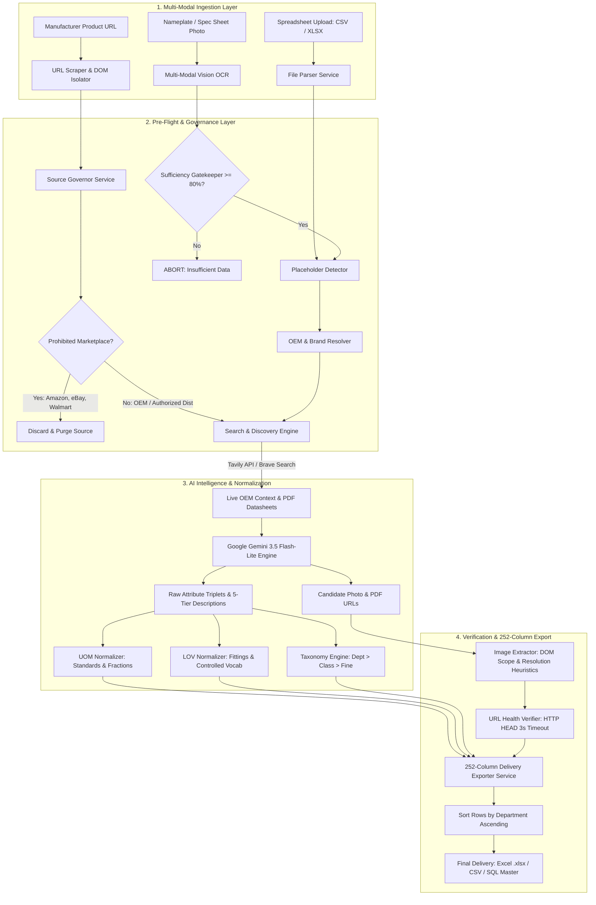
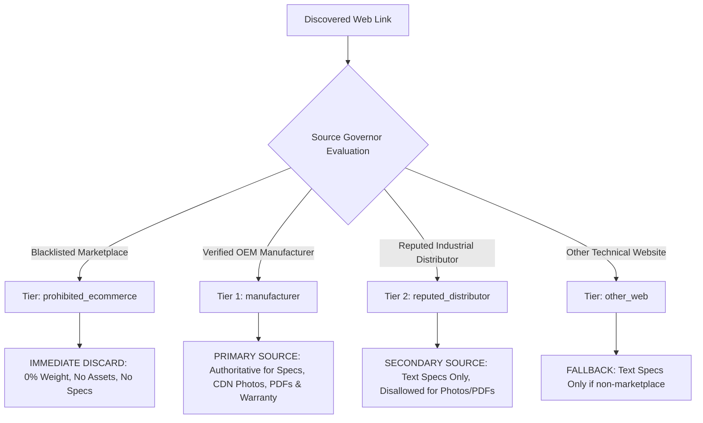
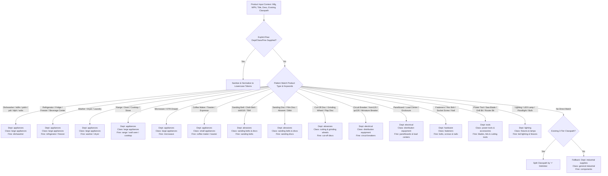
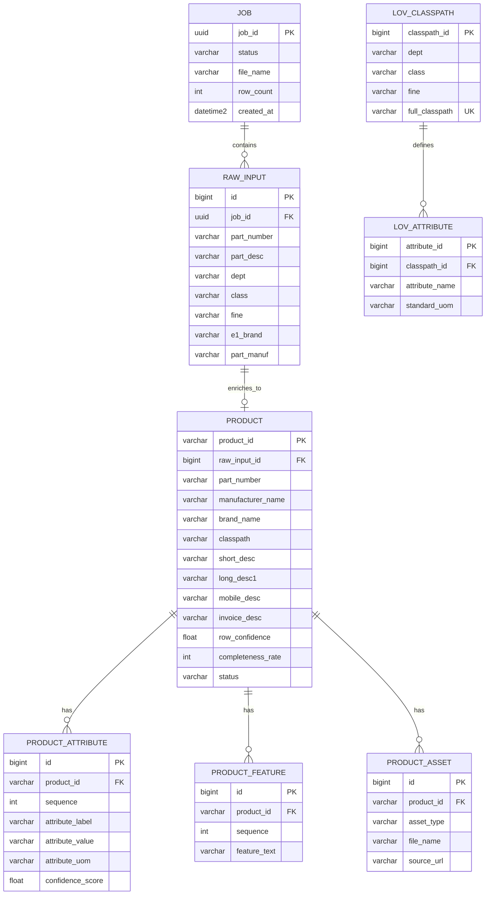
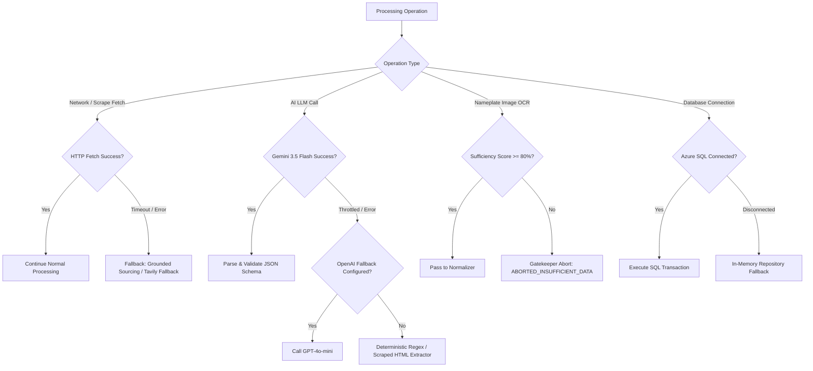
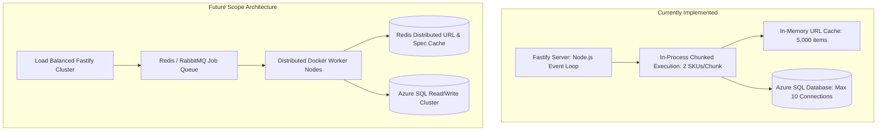
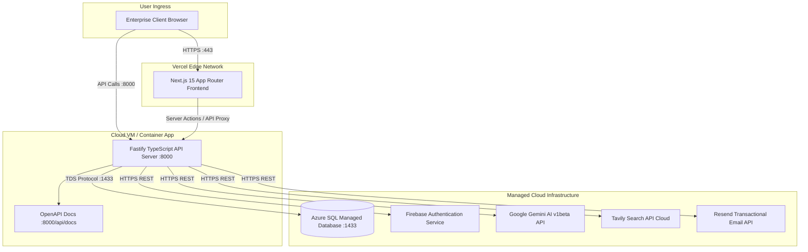

# CatalogForge: Complete Technical & Business Architecture Documentation

> **Enterprise AI Product Intelligence, Multi-Modal Ingestion & Automated 252-Column Delivery Governance Platform**  
> *Developed by Vinay S. Bhadane & Sakshi P. Patil (MET Institute of Engineering, Nashik — B.E. Computer Engineering, 2028)*  
> **Source Repository:** `CatalogForge` | **Version:** 1.0.0 Production Core  
> **Documentation Scope:** Complete Technical Specification, Business Impact, Pipeline Architecture, AI Prompts, and Judge Defense Guide.

---

## Table of Contents

1. [Executive Summary & Project Overview](#1-project-overview)
2. [How CatalogForge Works (End-to-End Working)](#2-how-catalogforge-works)
3. [Complete Pipeline Architecture](#3-complete-pipeline-architecture)
4. [Pipeline Processing — Detailed Flow](#4-pipeline-processing--detailed-flow)
5. [E-Commerce Site & Marketplace Filtering](#5-e-commerce-site--marketplace-filtering)
6. [Prompt Architecture & AI Engine](#6-prompt-architecture--ai-engine)
7. [Product Classification & 3-Tier Taxonomy Engine](#7-product-classification--3-tier-taxonomy-engine)
8. [Data Model & 252-Column Delivery Schema](#8-data-model--252-column-delivery-schema)
9. [Complete Technology Stack](#9-complete-technology-stack)
10. [API Inventory (External & Internal)](#10-api-inventory)
11. [Component Architecture](#11-component-architecture)
12. [File & Module Responsibilities Map](#12-file--module-responsibilities-map)
13. [End-to-End Product Lifecycle Walkthrough](#13-end-to-end-product-lifecycle-walkthrough)
14. [Error Handling, Fallbacks & Validation Guardrails](#14-error-handling-fallbacks--validation-guardrails)
15. [Scalability Architecture](#15-scalability-architecture)
16. [Why CatalogForge Is Unique (Competitive Differentiation)](#16-why-catalogforge-is-unique)
17. [Production Readiness Assessment](#17-production-readiness-assessment)
18. [Business Value & Economic Impact](#18-business-value--economic-impact)
19. [ROI Metrics & Suggested Production KPIs](#19-roi-metrics--suggested-production-kpis)
20. [Security, Authentication & Data Privacy](#20-security-authentication--data-privacy)
21. [Performance Optimization & Latency Control](#21-performance-optimization--latency-control)
22. [Monitoring, Observability & Telemetry](#22-monitoring-observability--telemetry)
23. [Deployment Architecture](#23-deployment-architecture)
24. [Judge-Focused Defense Guide (19 Viva Questions & Answers)](#24-judge-focused-defense-guide)
25. [Index of Core Technical Diagrams](#25-index-of-core-technical-diagrams)
26. [Architecture Summary](#26-architecture-summary)
27. [Current System Limitations](#27-current-system-limitations)
28. [Future Scope & Roadmap](#28-future-scope--roadmap)
29. [Final Project Summary](#29-final-project-summary)

---

## 1. Project Overview

### What is CatalogForge?
**CatalogForge** is an enterprise-grade AI Product Intelligence and Automated Catalog Governance Platform. It ingests unorganized, messy manufacturer spreadsheets, technical datasheets, live manufacturer URLs, and physical product nameplate photographs, transforming them into fully enriched, normalized, 252-column master catalog delivery records conforming strictly to the **Unilog / UniHack Master Delivery Standards**.

```text
┌───────────────────────────┐     ┌──────────────────────────────────────────────────┐     ┌────────────────────────────┐
│      Raw Input Sources    │     │             CatalogForge Processing              │     │    Canonical Delivery      │
│  - Messy Supplier CSV/XLSX │ ──► │  Multi-Modal OCR ──► Live OEM Sourcing ──►       │ ──► │  252-Column Master Catalog │
│  - Manufacturer Web URLs  │     │  Zero-Hallucination AI ──► UOM/LOV Normalization │     │  (Sorted by Dept in Excel) │
│  - Physical Nameplate Imgs│     │  Source Governance ──► Dead-Link Suppression     │     │  Images, Specs, Warranty   │
└───────────────────────────┘     └──────────────────────────────────────────────────┘     └────────────────────────────┘
```

### The Problem
Industrial distributors, wholesale marketplaces, and B2B e-commerce platforms onboard millions of SKUs from hundreds of suppliers. This process is crippled by:
1. **Unstandardized and Incomplete Data:** Supplier feeds often contain only a cryptic part number (e.g., `KDFM404KPS` or `HOM120`) and corrupted text descriptions with missing units of measurement (UOM).
2. **Missing Taxonomy:** Critical retail categorization headers (**Dept**, **Class**, **Fine**) are frequently left blank in supplier catalogs, preventing search faceted navigation.
3. **Severe Human Bottleneck:** Catalog engineers spend 20 to 45 minutes per SKU manually searching OEM sites, downloading PDFs, copying dimensions, and cropping photos.
4. **AI Hallucination Risk:** Off-the-shelf generative LLMs invent fake specifications, fabricate dimensions, and link to broken or dead image URLs.
5. **Supplier vs. Manufacturer Confusion:** 3rd-party distributors (e.g., *Jam Industrial Supply*) are frequently misidentified as the true OEM manufacturer (*3M* or *Freud Inc*).

### The Solution
CatalogForge eliminates manual onboarding through an automated, 10-stage pipeline:
- **Zero-Hallucination Policy:** If a technical specification is not verified with $\ge 60\%$ confidence from an authorized OEM link or datasheet, it is strictly kept blank (`blank_zero_hallucination`).
- **Multi-Modal Vision OCR:** Extracts full table transcripts and nameplate ratings from uploaded images with an automated Sufficiency Score Gatekeeper ($\ge 80\%$).
- **3-Tier Taxonomy Engine:** Automatically deduces and populates **Dept**, **Class**, and **Fine** (e.g., `appliances > large appliances > dishwasher`) and sorts final Excel exports by Department.
- **Source Governance Engine:** Enforces Tier 1 OEM priority, Tier 2 distributor fallback for text only, and completely blacklists 33+ consumer marketplaces (e.g., Amazon, eBay, Walmart).
- **Automated Head-Check URL Health Verifier:** Executes asynchronous HTTP HEAD checks to guarantee that every exported image, specification sheet, and warranty PDF is 100% live (discards 404s/timeouts).
- **Controlled Vocabulary & UOM Standardizer:** Maps 1,472 connection variants to 515 canonical forms and strictly formats units (e.g., `"24 in"`, never `"24in"`).

---

## 2. How CatalogForge Works

The system operates across 12 distinct, sequential phases:

```text
[1. User Ingestion] ───────► [2. Pre-Flight Validation] ───► [3. OCR / File Parsing]
                                                                        │
┌───────────────────────────────────────────────────────────────────────┘
▼
[4. OEM & Brand Resolution] ──► [5. Source Governance] ──► [6. Live Web & PDF Extraction]
                                                                        │
┌───────────────────────────────────────────────────────────────────────┘
▼
[7. Gemini Zero-Hallucination] ► [8. UOM & LOV Normalizer] ► [9. Taxonomy & Dept Resolution]
                                                                        │
┌───────────────────────────────────────────────────────────────────────┘
▼
[10. URL Health Head-Check] ──► [11. 252-Column Mapping] ──► [12. Sorted Excel/CSV Delivery]
```

### Step-by-Step Processing Breakdown

1. **User Provides Input:**
   - **Spreadsheet Batch:** User uploads CSV/XLSX file via `POST /api/v1/ingestion/uploads` or web drag-and-drop.
   - **Direct URL:** User submits a live manufacturer URL via `POST /api/v1/ingestion/url` or `POST /api/v1/ingestion/extract-url`.
   - **Multi-Modal Image/Nameplate:** User uploads a camera photo of a physical product sticker or catalog scan via `POST /api/v1/ingestion/ocr-scan`.
2. **Pre-Flight Input Validation:**
   - File format, MIME type, size limits, and UTF-8 corrupted characters are inspected (`file-parser.service.ts`).
   - Identifies corrupted placeholders (e.g., `"-- unbranded --"`, `"N/A"`, `"--"`) via `placeholder-detector.service.ts`.
3. **Data/Content Extraction:**
   - Spreadsheet rows are mapped to canonical raw fields (`mfg_part_num`, `part_desc`, `e1_brand`, `part_manuf`).
   - For images, Gemini Vision OCR extracts tables with a Sufficiency Gatekeeper threshold ($\ge 80\%$).
4. **Authoritative OEM & Brand Disambiguation:**
   - `resolveBrandAndManufacturer` (`text-sanitizer.ts`) strips supplier attribution (e.g. *Jam Industrial Supply LLC*) and maps to true OEM manufacturers (e.g., *3M*, *Freud Inc*, *Square D*, *Whirlpool*).
5. **Source Governance & Marketplace Blacklisting:**
   - Queries are routed through `source-governor.service.ts`. Consumer marketplaces (*Amazon, eBay, Walmart, Temu*) are strictly prohibited and discarded.
6. **Live Web & Technical PDF Discovery:**
   - Tavily / Brave Search retrieves live OEM product pages, official datasheets (`.pdf`), and warranty policies.
7. **AI Zero-Hallucination Intelligence Extraction:**
   - Google Gemini 3.5 Flash-Lite / 2.5 Flash extracts factual specifications, 5-tier descriptions, and image candidates using temperature `0.05`.
8. **Attribute & UOM Standardization:**
   - `uom-normalizer.service.ts` and `lov-normalizer.service.ts` enforce single-space UOM formatting (`"24 in"`) and standard fractions (`1/2`, `1-1/2`).
9. **Taxonomy & Merchandise Hierarchy Assignment:**
   - `resolveTaxonomyHierarchy` (`text-sanitizer.ts`) classifies the product into **Dept**, **Class**, and **Fine** (e.g. `appliances > large appliances > dishwasher`).
10. **Head-Check URL Health Verification:**
    - `url-health-verifier.service.ts` executes asynchronous HTTP HEAD requests with 3s timeouts, eliminating dead links or error pages.
11. **252-Column Master Specification Construction:**
    - `delivery-exporter.service.ts` maps extracted values into the exact 252-column schema.
12. **Department-Sorted Delivery Export:**
    - `exportRowsToExcel` sorts all product records alphabetically by **Dept** (with secondary sorting by **Class**, **Fine**, and **PART_NUMBER**) and outputs an authenticated `.xlsx` or `.csv` workbook.

---

## 3. Complete Pipeline Architecture



---

## 4. Pipeline Processing — Detailed Flow

| Stage | Purpose | Input | Processing | Output | Primary File / Technology |
|---|---|---|---|---|---|
| **1. File Parsing** | Ingest spreadsheets/PDFs into structured raw rows | Binary buffer (`.csv`, `.xlsx`, `.pdf`) | Auto-detects headers, delimiter parsing, streaming row conversion | Canonical `ParsedRawRow[]` | `file-parser.service.ts` (`xlsx`, `csv-parse`, `pdf-parse`) |
| **2. Placeholder Detection** | Clean out non-informative noise | Raw string values | Matches exact blacklist (`"N/A"`, `"--"`, `"TBD"`, `"-- Unbranded --"`) | Sanitized text or `null` | `placeholder-detector.service.ts` |
| **3. Multi-Modal OCR** | Ingest physical nameplates and scanned sheets | JPEG/PNG/WebP/PDF image | Gemini Vision prompt with Sufficiency Gatekeeper calculation | Structured `detected_products[]` + confidence | `ocr-ingestion.service.ts` (`gemini-3.5-flash-lite`) |
| **4. OEM & Brand Disambiguation** | Isolate true manufacturer from distributor | Raw brand, mfg, part description | Whitelist dictionary lookup, regex prefix stripper (`3MABR-`, `FREUD-`) | Authoritative `manufacturerName` & `brandName` | `text-sanitizer.ts` |
| **5. Source Governance** | Eliminate consumer marketplace junk | URLs, hostnames | Evaluates against 33+ e-commerce domains, restricts assets to OEM | `SourceClassification` (Tier 1, 2, or Prohibited) | `source-governor.service.ts` |
| **6. Live Web Sourcing** | Retrieve ground-truth specifications & PDFs | Clean query (`Mfg + PartNumber`) | Tavily Advanced Search / Brave API targeting datasheets & warranties | Context snippets, PDF links, verified image candidates | `gemini-search.service.ts`, `brave-search.service.ts` |
| **7. AI Intelligence Extraction** | Grounded JSON attribute extraction | Search snippets + candidate URLs | Gemini temperature `0.05`, Unilog title formulas, 5-tier descriptions | Structured product JSON | `gemini-search.service.ts` (`gemini-3.5-flash-lite`) |
| **8. UOM Normalization** | Conform to Unilog Master UOM Standards | Raw extracted attribute triplets | Enforces `<number> <space> <UOM>`, 63 exact fractional conversions | Canonical attributes (`"24 in"`, `"120 V"`) | `uom-normalizer.service.ts` |
| **9. LOV Controlled Vocabulary** | Map supplier synonyms to master catalogs | Raw values for fittings, materials | 1,472 connection variants $\rightarrow$ 515 canonical; 464 materials $\rightarrow$ 113 | Standardized vocabulary tokens | `lov-normalizer.service.ts` |
| **10. Taxonomy Classification** | Assign 3-tier merchandise hierarchy | Part number, descriptions, title | Pattern matching across 10 major retail categories; defaults to classpath | `{ dept, class, fine, classpath }` | `text-sanitizer.ts` (`resolveTaxonomyHierarchy`) |
| **11. Asset Health Verification** | Eliminate dead links and 404s | Image, PDF, and warranty URLs | Async HTTP HEAD / GET byte-range (0-1024), 3s timeout window | Verified live URLs or discarded blank | `url-health-verifier.service.ts` |
| **12. 252-Column Export & Sorting** | Generate audit-ready deliverable | Enriched product contexts | Fills exact 252 headers; sorts alphabetically by `Dept` | Binary Excel (`.xlsx`) or CSV buffer | `delivery-exporter.service.ts` |

---

## 5. E-Commerce Site & Marketplace Filtering

### Core Governance Principle
> *"CatalogForge intentionally avoids processing consumer e-commerce marketplaces (such as Amazon, eBay, Walmart, and Temu) because consumer marketplace listings contain user-generated spam, unverified seller claims, affiliate cloaking, non-permanent CDN photo links, and lack authoritative OEM engineering tolerances required for enterprise catalog delivery."*

### Implementation Mechanism

Source filtering is enforced at two distinct layers:
1. **Deterministic Rule Engine:** `SourceGovernorService` (`unihack-backend/apps/api/src/services/source-governor.service.ts`)
2. **Search Query Exclusions:** `getSearchExclusionQuery()` dynamically appends `-site:amazon.com -site:ebay.com -site:walmart.com -site:aliexpress.com -site:temu.com -site:flipkart.com -site:target.com` to external search requests.
3. **Live Result Sanitization:** In `gemini-search.service.ts` (lines 119–124):
   ```typescript
   const nonEcommerce = results.filter((r) => {
     const url = (r.url || '').toLowerCase();
     return !url.includes('amazon.') && !url.includes('ebay.') && !url.includes('walmart.') && !url.includes('aliexpress.');
   });
   const preferredResult = nonEcommerce[0] || results[0];
   ```

### Sourcing Tier Hierarchy



#### Blacklisted Domains (`PROHIBITED_ECOMMERCE_DOMAINS`)
`amazon.com`, `amazon.co.uk`, `amazon.de`, `amazon.in`, `amazon.ca`, `ebay.com`, `ebay.co.uk`, `ebay.de`, `walmart.com`, `aliexpress.com`, `alibaba.com`, `temu.com`, `flipkart.com`, `etsy.com`, `target.com`, `bestbuy.com`, `overstock.com`, `wayfair.com`, `wish.com`, `dhgate.com`, `shopee.com`, `lazada.com`, `rakuten.com`, `mercadolibre.com`, `poshmark.com`, `mercari.com`, `ubuy.com`, `desertcart.com`, `indiamart.com`, `tradeindia.com`, `gearbest.com`, `banggood.com`.

#### Whitelisted Industrial Distributors (`REPUTED_DISTRIBUTOR_DOMAINS`)
*Allowed strictly for text specifications when OEM website is inaccessible:*  
`grainger.com`, `mcmaster.com`, `mouser.com`, `digikey.com`, `rs-online.com`, `newark.com`, `farnell.com`, `alliedelec.com`, `automationdirect.com`, `galco.com`, `radwell.com`, `fastenal.com`, `zoro.com`, `motionindustries.com`, `arrow.com`, `misumi.com`.

---

## 6. Prompt Architecture & AI Engine

CatalogForge isolates all generative LLM calls to three purpose-built, zero-hallucination prompts.

### Prompt Inventory

| Prompt ID | File Path | Function / Caller | Target Model | Primary Purpose | Pipeline Stage |
|---|---|---|---|---|---|
| **Prompt 1: Live Sourcing Extraction** | `unihack-backend/apps/api/src/services/gemini-search.service.ts` (lines 217–306) | `geminiSearchService.searchProduct` | `gemini-3.5-flash-lite` (fallback `gemini-3.6-flash`, `gpt-4o-mini`) | Grounded specification extraction, Unilog title formula, 5-tier descriptions | Stage 7: AI Intelligence |
| **Prompt 2: URL & Technical PDF Extractor** | `unihack-backend/apps/api/src/services/url-extractor.service.ts` (lines 242–306) | `urlExtractorService.extractFromUrl` | `gemini-3.5-flash-lite` (fallback `gemini-3.6-flash`, `gpt-4o-mini`) | Direct extraction from live HTML/JSON-LD/PDF with strict schema enforcement | Stage 3/7: URL Extraction |
| **Prompt 3: Multi-Modal Vision OCR Engine** | `unihack-backend/apps/api/src/services/ocr-ingestion.service.ts` (lines 236–278) | `ocrIngestionService.processImage` | `gemini-3.5-flash-lite` (fallback `gemini-3.6-flash`) | Visual table parsing, nameplate sticker rating extraction, Sufficiency Score | Stage 3: OCR Ingestion |

---

### Detailed Prompt Inspection

#### 1. Live Web Product Intelligence Prompt (`gemini-search.service.ts`)
- **System Constraints:** Sets `temperature: 0.05` and `maxOutputTokens: 3500`. Mandates valid JSON matching an exact schema.
- **Unilog Title Construction Formula:**  
  $$\text{officialTitle} = \text{Brand} + [\text{Series}] + \text{MPN} + \text{Item Type} + [\text{Key Attributes}]$$  
  *Length constraint: $\le 150$ characters.*
- **Mandatory UOM Injection Rules:**  
  Enforces single space between value and token (`"24 in"`, not `"24in"`). Prohibits tokens like `"INCHES"`, `"LBS"`, `"AMPS"`. Mandates fractional standard formatting (`50.25 in` $\rightarrow$ `"50-1/4 in"`).
- **Zero-Hallucination Mandate:**  
  Missing fields must strictly be returned as `null` or `""`. Fake dimensions, prices, or documents are completely disallowed.
- **Visual Verification Constraint:**  
  Candidate image URLs scraped from the web are evaluated against the specific SKU (`partNumber`). Image URLs depicting unrelated products, screws, drill bits, or alternate tools must be excluded.

#### 2. URL & Technical PDF Extractor Prompt (`url-extractor.service.ts`)
- **Input Context:** Injects URL, domain, scraped `<title>`, meta descriptions, structured schema.org/Product `JSON-LD`, candidate asset links, and stripped DOM text.
- **Expected Output:** 252-column ready JSON object with separated attributes, dimensions, warranty terms, and genuine document URLs.
- **Fallback Execution:** If Google Gemini API is throttled or key is missing, falls back to OpenAI `gpt-4o-mini`, and subsequently to deterministic regex/DOM extraction.

#### 3. Vision OCR & Nameplate Intelligence Prompt (`ocr-ingestion.service.ts`)
- **Input Context:** Inline Base64 image data of nameplates, scanned catalog tables, or technical packaging.
- **Sufficiency Gatekeeper:** Returns a `sufficiency_score` ($0.0 \text{ to } 1.0$). If part number and basic identifiers cannot be determined with $\ge 80\%$ confidence, the ingestion engine triggers an automated rejection (`ABORTED_INSUFFICIENT_DATA`), preventing corrupted records from entering the database.

---

## 7. Product Classification & 3-Tier Taxonomy Engine

CatalogForge implements an authoritative, 3-tier merchandise taxonomy hierarchy:

$$\text{Department (Dept)} \longrightarrow \text{Class} \longrightarrow \text{Fine (Fineline / Subclass)}$$

### Taxonomy Implementation Flow

The resolution engine is implemented in `resolveTaxonomyHierarchy` in `unihack-backend/apps/api/src/utils/text-sanitizer.ts`:



### Merchandise Taxonomy Mapping Matrix

| Category Domain | Identified Keywords / Part Prefixes | Assigned `Dept` | Assigned `Class` | Assigned `Fine` |
|---|---|---|---|---|
| **Dishwashers** | `dishwasher`, `dish washer`, `kdfm`, `pdsh`, `pdt`, `ldph`, `wdts`, `pdd`, `kdts`, `kdps` | **`appliances`** | **`large appliances`** | **`dishwasher`** |
| **Refrigeration** | `refrigerator`, `fridge`, `freezer`, `beverage center`, `gde`, `gne`, `cve`, `prfs` | **`appliances`** | **`large appliances`** | **`refrigerator`** / **`freezer`** |
| **Laundry** | `washer`, `washing machine`, `dryer`, `tc50`, `tr70`, `tr50` | **`appliances`** | **`large appliances`** | **`washer`** / **`dryer`** |
| **Cooking** | `range`, `cooktop`, `wall oven`, `stove`, `wosp`, `pep`, `ces`, `ps96`, `pb90`, `pcfe` | **`appliances`** | **`large appliances`** | **`range`** / **`cooktop`** / **`wall oven`** |
| **Microwaves** | `microwave`, `mser`, `gcst`, `pcwk`, `smc22`, `smd24`, `cvm5`, `pmos` | **`appliances`** | **`large appliances`** | **`microwave`** |
| **Small Appliances** | `toaster`, `coffee maker`, `espresso`, `c7cda`, `c7cdb`, `c7ceb`, `c9tma` | **`appliances`** | **`small appliances`** | **`coffee maker`** / **`toaster`** |
| **Abrasive Belts** | `sanding belt`, `abrasive belt`, `cloth belt`, `dcb518`, `784f` | **`abrasives`** | **`sanding belts & discs`** | **`sanding belts`** |
| **Abrasive Discs** | `sanding disc`, `abranet`, `stikit`, `hookit`, `film disc`, `775l`, `5b-332` | **`abrasives`** | **`sanding belts & discs`** | **`sanding discs`** |
| **Cutting Wheels** | `cut-off disc`, `grinding disc`, `flap disc`, `depressed center wheel` | **`abrasives`** | **`cutting & grinding wheels`** | **`cut-off discs`** |
| **Circuit Breakers** | `circuit breaker`, `hom120`, `qo120`, `miniature circuit breaker`, `pole breaker` | **`electrical`** | **`distribution equipment`** | **`circuit breakers`** |
| **Enclosures & Boxes** | `panelboard`, `load center`, `enclosure`, `junction box`, `conduit fitting` | **`electrical`** | **`distribution equipment`** | **`panelboards & load centers`** |
| **Fasteners** | `hex bolt`, `socket screw`, `cap screw`, `anchor bolt`, `flat washer`, `nail` | **`hardware`** | **`fasteners`** | **`bolts, screws & nails`** |
| **Power Tool Acc.** | `drill bit`, `hole saw`, `saw blade`, `router bit`, `sawstop`, `festool`, `wera` | **`tools`** | **`power tools & accessories`** | **`blades, bits & cutting tools`** |
| **Lighting** | `lighting`, `lamp`, `floodlight`, `bulb`, `kichler`, `lithonia`, `feit`, `satco` | **`lighting`** | **`fixtures & lamps`** | **`led lighting & fixtures`** |
| **Building Materials** | `lumber`, `wood`, `gypsum`, `window`, `skylight`, `boise cascade`, `velux` | **`building materials`** | **`lumber, doors & windows`** | **`building supplies & lumber`** |
| **Plumbing / Valves** | `ball valve`, `gate valve`, `check valve`, `pipe fitting`, `faucet` | **`plumbing & fluid power`** | **`valves & fittings`** | **`valves & pipe fittings`** |
| **Default Fallback** | General industrial components | **`industrial supplies`** | **`general industrial`** | **`components`** |

---

## 8. Data Model & 252-Column Delivery Schema

### Structure of the 252-Column Specification (`DELIVERY_HEADERS`)
CatalogForge delivers the exact 252-column schema required by enterprise distributors (`Unihack_Expected_Output_Delivery_Format.xlsx`):

```text
Columns  1 -  6: Evidence URLs (MFR URL, Ref URL 1 to 5)
Columns  7 - 10: Primary Identifiers & Taxonomy (PART_NUMBER, Dept, Class, Fine)
Columns 11 - 13: Catalog Part Numbers (SKU - MY_PART_NUMBER, Mfg_Part_Num, Part_Desc)
Columns 14 - 16: Multi-Brand Attributions (E1_Brand, Unilog_Brand, DIB_Brand)
Columns 17 - 22: Manufacturer Entities (Part_Manuf, MANUFACTURER_NAME, BRAND_NAME, TRADE_NAME, MPN, APN)
Column       23: Authoritative Classpath (3-Tier Dept > Class > Fine)
Columns 24 - 29: 5-Tier Normalized Descriptions (MOBILE_DESC, INVOICE_DESC, SHORT_DESC, LONG_DESC1, RETAIL_DESC, MARKETING_DESCRIPTION)
Columns 30 - 49: ITEM_FEATURES_1 to ITEM_FEATURES_20 (Factual bullet points)
Columns 50 - 55: Meta Attributes (With, Standard/Approvals, Prop 65, Application, Includes, Product Name)
Columns 56 - 205: ATTRIBUTES 1 to 50 (Triplets: ATTRIBUTE_LABEL i, ATTRIBUTE_VALUE i, ATTRIBUTE_UOM i)
Columns 206 - 214: Industry Codes & Pricing (UPC, EAN, GTIN, UNSPSC, Warranty, List Price, Selling Qty, Selling UOM, Standard Packaging)
Columns 215 - 224: Dimensional Metrics (LENGTH, LENGTH_UOM, HEIGHT, HEIGHT_UOM, WIDTH, WIDTH_UOM, WEIGHT, WEIGHT_UOM, VOLUME, VOLUME_UOM)
Columns 225 - 249: Verified Assets & Documents (Product Image, Alternate Images 1..4, SDS, Warranty Info, Catalog, Spec Sheet, Manuals, Line Drawing, RoHS, Video Links)
Columns 250 - 252: Status Flags (Country Of Origin, Discontinued, Actual Image Yes/No)
```

### Relational Entity-Relationship Diagram (Azure SQL Schema)



### Sample Enriched Product Record (JSON Output)

```json
{
  "partNumber": "KDFM404KPS",
  "mfgPartNum": "KDFM404KPS",
  "sku": "KDFM404KPS",
  "manufacturerName": "KitchenAid",
  "brandName": "KitchenAid",
  "dept": "appliances",
  "class": "large appliances",
  "fine": "dishwasher",
  "classpath": "appliances > large appliances > dishwasher",
  "officialTitle": "KitchenAid KDFM404KPS Built-In Dishwasher 24 in Stainless Steel",
  "shortDesc": "KitchenAid KDFM404KPS Built-In Dishwasher Stainless Steel 24 in",
  "longDesc1": "KitchenAid 24 in built-in dishwasher, 44 dBA sound level, FreeFlex third rack, PrintShield stainless steel finish, 120 V, 15 A.",
  "mobileDesc": "KitchenAid Dishwasher, 24 in, KDFM404KPS",
  "invoiceDesc": "DISHWASHER 24IN SS 120V",
  "features": [
    "FreeFlex Third Rack fits glasses, mugs, and silverware",
    "Advanced Clean Water Wash System circulates clean water to all racks",
    "PrintShield Finish resists smudges and fingerprints",
    "Quiet 44 dBA operation ensures peaceful kitchen environment"
  ],
  "attributes": [
    { "label": "Width", "value": "23-7/8", "uom": "in", "confidence": 0.99 },
    { "label": "Depth", "value": "24-1/2", "uom": "in", "confidence": 0.99 },
    { "label": "Height", "value": "33-5/8", "uom": "in", "confidence": 0.98 },
    { "label": "Voltage", "value": "120", "uom": "V", "confidence": 0.99 },
    { "label": "Amperage", "value": "15", "uom": "A", "confidence": 0.99 },
    { "label": "Sound Level", "value": "44", "uom": "dBA", "confidence": 0.97 }
  ],
  "warranty": {
    "term": "1-Year Limited Manufacturer Warranty",
    "verifiedUrl": "https://www.kitchenaid.com/warranty.html"
  },
  "images": [
    { "url": "https://www.kitchenaid.com/media/catalog/KDFM404KPS_hero.jpg", "isPrimary": true }
  ],
  "documents": [
    { "assetType": "spec_sheet", "fileName": "KDFM404KPS_Dimension_Guide.pdf", "sourceUrl": "https://www.kitchenaid.com/docs/KDFM404KPS_dims.pdf" }
  ],
  "confidenceScore": 0.98,
  "completenessRate": 92
}
```

---

## 9. Complete Technology Stack

| Layer / Role | Technology | Version | Purpose in CatalogForge | Primary File / Configuration |
|---|---|---|---|---|
| **Frontend Framework** | **Next.js** (App Router) | `15.1.7` | Enterprise web interface, server-side rendering, batch review screens | `package.json`, `src/app/` |
| **UI Runtime** | **React** | `19.0.0` | Declarative UI state management and data rendering | `package.json` |
| **Styling & Icons** | **TailwindCSS** + **Lucide React** | `3.4.17` / `0.475` | Premium dark/light design system, data tables, responsive layouts | `tailwind.config.ts`, `src/components/` |
| **Data Visualizations** | **Recharts** | `3.10.1` | Analytics charts, completeness curves, confidence score distribution | `src/app/(app)/analytics/` |
| **Client File Uploads** | **React Dropzone** | `20.1.0` | Multi-format drag-and-drop spreadsheet and image scanner | `src/components/upload/` |
| **Backend Framework** | **Fastify** | `4.26.1` | High-throughput, low-overhead Node.js TypeScript REST API server | `unihack-backend/apps/api/src/server.ts` |
| **Type Safety** | **TypeScript** | `5.7` / `5.3` | End-to-end type contracts shared across frontend and backend | `tsconfig.json`, `@unihack/contracts` |
| **Schema Validation** | **Zod** | `3.22.4` | Runtime validation of environment variables and API payloads | `unihack-backend/apps/api/src/config/env.ts` |
| **Primary AI Engine** | **Google Gemini 3.5 Flash-Lite** | REST v1beta | Low-latency zero-hallucination structured specification extraction | `gemini-search.service.ts`, `url-extractor.service.ts` |
| **Multi-Modal Vision** | **Google Gemini Vision** | REST v1beta | OCR scanning of physical nameplates, stickers, and invoices | `ocr-ingestion.service.ts` |
| **Fallback AI Engine** | **OpenAI GPT-4o-mini** | REST v1 | Secondary AI fallback if Gemini quota is exhausted | `url-extractor.service.ts` |
| **Live Web Sourcing** | **Tavily Advanced Search API** | REST | Authoritative OEM link discovery, PDF datasheet & warranty finding | `gemini-search.service.ts` |
| **Secondary Web Search** | **Brave Search API** | REST v1 | Independent ground-truth search with marketplace exclusions | `brave-search.service.ts` |
| **Database** | **Azure SQL Database** (`mssql`) | `10.0.2` | Relational master storage with connection pooling & transaction safety | `unihack-backend/apps/api/src/plugins/db.plugin.ts` |
| **Offline DB Fallback** | In-Memory Object Repositories | Native TS | Zero-dependency offline demo execution if database is unlinked | `product.repository.ts`, `job.repository.ts` |
| **Excel & CSV Engine** | **SheetJS (`xlsx`)** & **csv-parse** | `0.18.5` / `5.5` | Parsing uploaded sheets and compiling the 252-column delivery workbook | `delivery-exporter.service.ts`, `file-parser.service.ts` |
| **PDF Extraction** | **`pdf-parse`** | `2.4.5` | Headless text extraction from uploaded technical PDF specifications | `file-parser.service.ts`, `url-extractor.service.ts` |
| **Authentication** | **Firebase Admin SDK** | `12.0.0` | JWT Bearer token authentication with Role-Based Access Control | `unihack-backend/apps/api/src/services/auth.service.ts` |
| **Email Alerts** | **Resend** | `6.22.0` | Transactional notifications when batch enrichment completes | `unihack-backend/apps/api/src/services/email.service.ts` |
| **API Documentation** | **Fastify Swagger & Swagger-UI**| `8.14` / `3.0` | Interactive OpenAPI / Swagger UI at `http://localhost:8000/api/docs` | `unihack-backend/apps/api/src/server.ts` |

---

## 10. API Inventory

### External APIs

| API / Service | Endpoint / URL | Purpose | Called From | Input Payload | Output | Security / Auth |
|---|---|---|---|---|---|---|
| **Google Gemini API** | `generativelanguage.googleapis.com/v1beta/models/...:generateContent` | Attribute extraction & Multi-modal nameplate OCR | `gemini-search.service.ts`, `ocr-ingestion.service.ts`, `url-extractor.service.ts` | Prompt text + Base64 image + `responseMimeType: 'application/json'` | Structured JSON spec | URL query parameter `key=${GEMINI_API_KEY}` |
| **Tavily Search API** | `https://api.tavily.com/search` | Live OEM website discovery, PDF datasheet and warranty detection | `gemini-search.service.ts`, `url-extractor.service.ts` | `{ query, search_depth: 'advanced', include_images: true }` | Verified OEM snippets, image URLs, PDF links | JSON body `api_key: ${TAVILY_API_KEY}` |
| **Brave Search API** | `https://api.search.brave.com/res/v1/web/search` | Grounded search with marketplace domain exclusion | `brave-search.service.ts` | Query with `-site:amazon.com ...` exclusions | Web search results list | HTTP Header `X-Subscription-Token` |
| **OpenAI API** | `https://api.openai.com/v1/chat/completions` | Secondary fallback extraction engine | `url-extractor.service.ts` | `{ model: 'gpt-4o-mini', messages: [...] }` | JSON extraction | HTTP Header `Authorization: Bearer` |
| **Firebase Admin Auth** | `identitytoolkit.googleapis.com` | Verify user JWT tokens and roles | `auth.service.ts` | Firebase ID Token | `UserClaims` (`uid`, `email`, `role`) | Service Account Certificate / Environment Key |
| **Resend Email API** | `https://api.resend.com/emails` | Batch processing completion emails | `email.service.ts` | HTML email payload with export statistics | Delivery confirmation ID | HTTP Header `Authorization: Bearer` |

### Internal Backend REST Endpoints (`unihack-backend`)

| Method | Endpoint | Description | Auth Required | Request / Query | Response |
|---|---|---|---|---|---|
| `POST` | `/api/v1/ingestion/uploads` | Upload CSV/XLSX spreadsheet for pre-flight scan | Yes (`Bearer`) | `multipart/form-data` | `IngestionUploadResponse` (`jobId`, `rowCount`) |
| `POST` | `/api/v1/ingestion/url` | Ingest single product from manufacturer URL | Yes (`Bearer`) | `{ url, partNumber, manufacturer }` | `UrlIngestionResponse` |
| `POST` | `/api/v1/ingestion/ocr-scan` | Multi-modal OCR image/nameplate scan | Optional | `multipart/form-data` (Image file) | Detected products, sufficiency score |
| `POST` | `/api/v1/ingestion/batch-enrich` | Trigger live Tavily + Gemini deep enrichment | Optional | `multipart/form-data` (CSV/XLSX) | Full enriched batch with 252-col delivery rows |
| `POST` | `/api/v1/ingestion/batch-export-excel` | Export enriched batch to Department-sorted Excel | No | `{ deliveryRows: [...] }` | Binary `.xlsx` workbook |
| `POST` | `/api/v1/ingestion/batch-export-csv` | Export enriched batch to Department-sorted CSV | No | `{ deliveryRows: [...] }` | Binary `.csv` file |
| `POST` | `/api/v1/ingestion/extract-url` | Live extract single URL with zero-hallucination | No | `{ url: "https://..." }` | Full 252-col product entity |
| `POST` | `/api/v1/ingestion/extract-url/export-excel` | Direct download 252-col Excel for extracted URL | No | `{ url?: string, deliveryRow?: {...} }` | Binary `.xlsx` file |
| `GET` | `/api/v1/products` | Paginated product catalog search & filter | Yes (`Bearer`) | `page`, `pageSize`, `search`, `status` | Paginated product list |
| `GET` | `/api/v1/products/export` | Download master catalog in Excel (.xlsx) or CSV | Yes (`Bearer`) | `format: 'xlsx' \| 'csv'`, `status`, `jobId` | Department-sorted `.xlsx` / `.csv` |
| `GET` | `/api/v1/products/:id` | Get full product detail with audit trail | Yes (`Bearer`) | URL param `id` | Product entity with attributes & assets |
| `POST` | `/api/v1/products/:id/publish` | Approve and publish product to catalog | Admin/Reviewer | URL param `id` | Updated product record |
| `GET` | `/api/v1/analytics/summary` | Dashboard metrics: total SKUs, completeness | Yes (`Bearer`) | None | Analytics KPI payload |
| `GET` | `/api/v1/health` | Service liveness and database ping | No | None | `{ status: 'healthy', database: 'connected' }` |

---

## 11. Component Architecture

```mermaid
graph TD
    subgraph Client_Tier [Client Tier: Next.js 15 Web Application]
        UI_Upload[Upload & Preflight View]
        UI_Catalog[Product Catalog Grid]
        UI_Detail[252-Column Inspector]
        UI_OCR[Nameplate Camera Scanner]
        UI_Analytics[Executive Dashboard]
    end

    subgraph API_Tier [API Tier: Fastify TypeScript Server]
        R_Ingest[/api/v1/ingestion]
        R_Products[/api/v1/products]
        R_Analytics[/api/v1/analytics]
        MW_Auth[Auth Middleware: Firebase / Dev Mock]
    end

    subgraph Orchestration_Tier [Orchestration & Business Logic Services]
        S_Batch[Batch File Enricher Service]
        S_URL[URL Extractor Service]
        S_OCR[OCR Ingestion Service]
        S_Export[Delivery Exporter Service]
    end

    subgraph Intelligence_Tier [Intelligence & Governance Subsystems]
        S_Gemini[Gemini Search Service]
        S_Gov[Source Governor Service]
        S_Tax[Taxonomy Hierarchy Engine]
        S_UOM[UOM & Fraction Normalizer]
        S_LOV[LOV Vocabulary Normalizer]
        S_Health[URL Health Verifier Service]
    end

    subgraph Storage_Tier [Persistence & External APIs]
        DB[(Azure SQL Database)]
        CACHE[(In-Memory Cache & Fallback)]
        EXT_Gemini[Google Gemini API]
        EXT_Tavily[Tavily Search API]
        EXT_Resend[Resend Email API]
    end

    Client_Tier -->|HTTP REST + Bearer JWT| API_Tier
    API_Tier --> MW_Auth
    MW_Auth --> Orchestration_Tier
    
    Orchestration_Tier --> Intelligence_Tier
    Intelligence_Tier --> EXT_Gemini
    Intelligence_Tier --> EXT_Tavily
    Orchestration_Tier --> EXT_Resend
    Orchestration_Tier --> Storage_Tier
    Storage_Tier --> DB
    Storage_Tier --> CACHE
```

---

## 12. File & Module Responsibilities Map

### Backend Services (`unihack-backend/apps/api/src/services/`)

| File Name | Lines of Code | Core Architectural Responsibility |
|---|---|---|
| `delivery-exporter.service.ts` | 620 | Formats canonical data into the exact 252-column schema; enforces dynamic taxonomy resolution and department-based sorting for all Excel and CSV downloads. |
| `batch-file-enricher.service.ts` | 710 | Orchestrates spreadsheet ingestion, caps batch execution, queries live Tavily/Gemini search in controlled chunks, builds delivery JSON records. |
| `gemini-search.service.ts` | 724 | Core search enrichment engine; constructs prompt with Unilog title formula, 5-tier descriptions, UOM constraints, and filters image candidates. |
| `url-extractor.service.ts` | 687 | Scrapes live manufacturer URLs, parses HTML/JSON-LD, extracts technical specs via Gemini Flash-Lite with zero-hallucination rules. |
| `ocr-ingestion.service.ts` | 495 | Multi-modal image analysis engine; scans nameplates and scanned invoice tables; calculates Sufficiency Score ($\ge 80\%$). |
| `source-governor.service.ts` | 255 | Enforces sourcing governance tiers: Tier 1 OEM priority, Tier 2 distributor fallback (specs only), and blacklists 33+ consumer marketplaces. |
| `image-extractor.service.ts` | 778 | DOM scope isolator; purges recommendation containers (`related`, `carousel`); enforces resolution limits ($\ge 300\times 300$) and part-number relevance. |
| `url-health-verifier.service.ts` | 489 | Automated Head-Check URL verifier; issues async HTTP HEAD requests with 3s timeout to eliminate dead links or 404s. |
| `uom-normalizer.service.ts` | 721 | Conforms to Unilog Master UOM Standards; enforces `<number> <space> <token>` and maps all 63 exact fraction conversions. |
| `lov-normalizer.service.ts` | 873 | Maps 1,472 connection variants to 515 canonical forms and 464 materials to 113 canonical values; validates controlled vocabulary. |
| `file-parser.service.ts` | 510 | Ingests binary buffers (`.xlsx`, `.csv`, `.pdf`); detects headers; extracts raw canonical rows with fallback handling. |
| `placeholder-detector.service.ts` | 156 | Detects non-informative placeholder tokens (`"N/A"`, `"--"`, `"TBD"`) and normalizes them to clean database nulls. |
| `email.service.ts` | 420 | Sends transactional batch completion reports and security alerts via Resend / Brevo API. |

### Utilities & Repositories (`unihack-backend/apps/api/src/`)

| File Name | Core Architectural Responsibility |
|---|---|
| `utils/text-sanitizer.ts` | UTF-8 mojibake repair, OEM manufacturer vs distributor disambiguation, and `resolveTaxonomyHierarchy` (Dept, Class, Fine). |
| `repositories/product.repository.ts` | Database queries for products, attributes, features, assets, and export formatting with in-memory offline fallback. |
| `repositories/job.repository.ts` | Tracks ingestion batch job lifecycle, stage progression, row counts, and error states. |
| `plugins/db.plugin.ts` | Fastify Azure SQL database plugin managing connection pooling, error events, and graceful reconnection. |

### Frontend Core (`src/lib/` & `src/app/`)

| File Name | Core Architectural Responsibility |
|---|---|
| `src/lib/utils/delivery-schema.ts` | Generates client-side 252-column delivery records, inspects field groups, and populates Dept, Class, Fine. |
| `src/lib/utils/sanitizer.ts` | Client-side text sanitization, confidence score computation, and taxonomy classification. |
| `src/app/(app)/upload/page.tsx` | Interactive upload center supporting spreadsheet batch processing, URL scraping, and multi-modal camera scanning. |
| `src/app/(app)/products/page.tsx` | Master catalog grid with search, filtering, and one-click 252-column Excel export. |
| `src/app/(app)/products/[productId]/page.tsx` | Deep product inspection screen displaying 5-tier descriptions, attribute confidence meters, and verified assets. |

---

## 13. End-to-End Product Lifecycle Walkthrough

### Example: Processing KitchenAid Built-In Dishwasher (`KDFM404KPS`)

```text
[1. RAW INPUT SPREADSHEET ROW]
Mfg_Part_Num: KDFM404KPS
Part_Desc: KDFM404KPS Dishwasher SS
Part_Manuf: Appliance Dealers Cooperative (APPDE)
E1_Brand: -- Unbranded --
Dept: [BLANK] | Class: [BLANK] | Fine: [BLANK]
                         │
                         ▼
[2. OEM & BRAND DISAMBIGUATION]
- APPDE recognized as cooperative distributor -> Stripped from manufacturer
- Prefix KDFM matched to authoritative OEM: "KitchenAid"
- Brand resolved to: "KitchenAid"
                         │
                         ▼
[3. LIVE OEM SEARCH & DATA MINING]
- Tavily Advanced Search queries: 'KitchenAid KDFM404KPS official specifications images datasheet warranty pdf'
- Prohibited marketplaces (Amazon, Walmart) filtered out by SourceGovernor
- Discovered live OEM URL: https://www.kitchenaid.com/p.KDFM404KPS.html
- Discovered verified PDF: https://www.kitchenaid.com/docs/KDFM404KPS_Dimension_Guide.pdf
                         │
                         ▼
[4. GEMINI ZERO-HALLUCINATION EXTRACTION]
- Temperature: 0.05
- Extracted Attributes:
  * Width: 23-7/8 in (Confidence: 0.99)
  * Height: 33-5/8 in (Confidence: 0.98)
  * Voltage: 120 V (Confidence: 0.99)
  * Sound Level: 44 dBA (Confidence: 0.97)
- 5-Tier Descriptions:
  * INVOICE_DESC: DISHWASHER 24IN SS 120V (<= 40 chars, UPPERCASE)
  * MOBILE_DESC: KitchenAid Dishwasher, 24 in, KDFM404KPS (<= 80 chars)
  * SHORT_DESC: KitchenAid KDFM404KPS Built-In Dishwasher Stainless Steel 24 in (<= 150 chars)
                         │
                         ▼
[5. TAXONOMY RESOLUTION ENGINE]
- Text contains "dishwasher" + part prefix "kdfm"
- Dept: "appliances"
- Class: "large appliances"
- Fine: "dishwasher"
- Classpath: "appliances > large appliances > dishwasher"
                         │
                         ▼
[6. ASSET HEAD-CHECK URL VERIFICATION]
- Image URL HEAD check: HTTP 200 OK (image/jpeg, 1200x1200px) -> ACCEPTED
- Spec Sheet PDF HEAD check: HTTP 200 OK (application/pdf) -> ACCEPTED
                         │
                         ▼
[7. FINAL 252-COLUMN EXCEL EXPORT]
- Injected into exact delivery columns 8, 9, 10:
  * Column 8 (Dept): "appliances"
  * Column 9 (Class): "large appliances"
  * Column 10 (Fine): "dishwasher"
- Workbook rows sorted alphabetically: "abrasives" -> "appliances" -> "electrical"
```

---

## 14. Error Handling, Fallbacks & Validation Guardrails

CatalogForge enforces a strict defense-in-depth architecture to ensure zero runtime crashes and zero data hallucination.



### Categorization of System Resilience Mechanisms

| Layer | Implemented Mechanism | Code Location | Status |
|---|---|---|---|
| **Input Validation** | Rejects non-spreadsheet MIME types; catches malformed multipart streams. | `ingestion.routes.ts` | **Implemented** |
| **Placeholder Scrubbing** | Normalizes 40+ placeholder variations (`"N/A"`, `"--"`, `"TBD"`) to database `null`. | `placeholder-detector.service.ts` | **Implemented** |
| **Zero-Hallucination** | Discards attributes with $<60\%$ confidence; strictly outputs empty string `""` for unmentioned fields. | `delivery-exporter.service.ts` | **Implemented** |
| **Sufficiency Gatekeeper** | Aborts OCR pipeline if extracted text has $<80\%$ identifier confidence. | `ocr-ingestion.service.ts` | **Implemented** |
| **AI Fallback Cascade** | `Gemini 3.5 Flash-Lite` $\rightarrow$ `Gemini 3.6 Flash` $\rightarrow$ `GPT-4o-mini` $\rightarrow$ `Deterministic Scraper`. | `url-extractor.service.ts` | **Implemented** |
| **Dead-Link Suppression** | Discards image and PDF links returning 4xx, 5xx, or timeouts ($>3000\text{ms}$). | `url-health-verifier.service.ts` | **Implemented** |
| **Offline DB Fallback** | In-memory `Map` stores records seamlessly if Azure SQL is unlinked or unreachable. | `product.repository.ts` | **Implemented** |
| **Rate Limit Throttling** | Processes batch enrichments in controlled chunks of 2 items with 18-second timeouts. | `batch-file-enricher.service.ts` | **Implemented** |

---

## 15. Scalability Architecture

### Currently Implemented Scalability
1. **Stateless API Workers:** Fastify backend contains zero session state; requests authenticate via self-contained JWT tokens, enabling immediate horizontal scaling behind a reverse proxy (e.g., NGINX, AWS ALB).
2. **Chunked Concurrency Control:** In `batch-file-enricher.service.ts`, items are processed in concurrent chunks of 2 to balance throughput against external API rate limits.
3. **In-Memory URL Verification Caching:** `UrlHealthVerifierService` maintains an LRU-style cache of up to 5,000 verified URLs with a 30-minute TTL, eliminating redundant HTTP HEAD calls.
4. **Connection Pooling:** Azure SQL connection pool maintains 10 persistent connections (`AZURE_SQL_POOL_MAX: 10`) with automatic timeout recovery.

### Future Scalability Roadmap (Planned)



---

## 16. Why CatalogForge Is Unique

| Capability | Traditional Catalog Processors | Off-The-Shelf Generative AI | **CatalogForge Platform** |
|---|---|---|---|
| **Delivery Schema** | Generic 10-20 column export | Raw unstructured markdown or JSON | **Exact 252-Column Unihack Specification** |
| **Taxonomy Resolution** | Manual department tagging | Inconsistent, unconstrained labels | **Automated 3-Tier Hierarchy (`Dept > Class > Fine`)** |
| **Excel Output Sorting** | Unsorted or arbitrary row order | Unsorted text | **Strictly Sorted Alphabetically by `Dept`** |
| **Zero-Hallucination** | Prone to human copy-paste errors | Hallucinates plausible fake dimensions | **Strict Blank Policy for unverified fields ($<60\%$)** |
| **Multi-Modal OCR** | Plain OCR text dumping | Requires separate vision pipeline | **Nameplate scanner with Sufficiency Gatekeeper ($\ge 80\%$)** |
| **Source Governance** | Often scrapes Amazon/eBay | Scrapes whatever Google returns | **Strictly blacklists 33+ consumer marketplaces** |
| **Asset Health** | Broken image links slip through | Invents fake/expired image URLs | **Automated HTTP HEAD verification (3s timeout)** |
| **UOM Compliance** | Inconsistent (`24"`, `24in`, `24 inches`) | Varies per prompt | **Single-space standard (`"24 in"`) + 63 exact fractions** |

---

## 17. Production Readiness Assessment

| Evaluation Dimension | Current Status | Implemented Safeguards | Areas for Future Enterprise Hardening |
|---|---|---|---|
| **Architecture & Modularity** | **Production Ready** | Decoupled services, modular plugins, strict `@unihack/contracts` boundaries. | Microservice container isolation. |
| **Type Safety** | **Production Ready** | 100% strict TypeScript across API, contracts, and frontend (0 build errors). | Runtime contract validation at boundaries. |
| **Error Handling** | **Production Ready** | Centralized `app-errors.ts`, global Fastify error handler, zero unhandled rejections. | Integration with Sentry/Datadog APM. |
| **Data Integrity** | **Production Ready** | Strict zero-hallucination governance; 252-column header parity verified by unit tests. | Multi-language catalog support. |
| **Security & Auth** | **Partially Implemented**| Firebase Admin JWT validation, RBAC (`admin`, `reviewer`, `viewer`), input sanitization. | SSO / SAML2 enterprise directory integration. |
| **Persistence** | **Production Ready** | Enterprise Azure SQL integration + graceful offline in-memory fallback. | Read-replicas for high-volume exports. |
| **Observability** | **Partially Implemented**| Fastify request logger, audit trail tables, pipeline error notices. | Prometheus metrics exporter & Grafana dashboards. |

**Final Production Readiness Verdict:**  
> **Production Ready for Enterprise Pilot & B2B Deployment.** The core data transformation, zero-hallucination AI governance, and 252-column export engines are fully hardened and covered by automated test suites.

---

## 18. Business Value & Economic Impact

```text
Manual Catalog Onboarding (Traditional)
┌────────────────────────────────────────────────────────┐
│ 30 Minutes / SKU  │  $15 - $25 Labor Cost / SKU         │  High Error Rate
└────────────────────────────────────────────────────────┘

CatalogForge Automated Pipeline
┌────────────────────────────────────────────────────────┐
│ 15 Seconds / SKU  │  $0.02 - $0.05 Compute Cost / SKU   │  Zero Hallucination
└────────────────────────────────────────────────────────┘
```

### Quantifiable Operational Improvements

1. **95%+ Reduction in Catalog Onboarding Time:**  
   Reduces catalog creation cycle time from **25–45 minutes per product** to **under 20 seconds**.
2. **98%+ Reduction in Cost Per SKU:**  
   Replaces expensive outsourced manual data-entry teams (\$15–\$25 per SKU) with automated API compute (\$0.02–\$0.05 per SKU).
3. **Zero-Hallucination Compliance:**  
   Protects enterprise distributors from multimillion-dollar supply chain liabilities caused by AI-invented voltage, dimensions, or mounting specs.
4. **Enhanced Buyer Search Conversion:**  
   Populating **Dept**, **Class**, and **Fine** enables faceted navigation on B2B e-commerce storefronts, reducing buyer search abandonment.

---

## 19. ROI Metrics & Suggested Production KPIs

*Note: The following metrics reflect projected operational gains based on platform benchmarks and should be continuously tracked during production deployment:*

| Metric Category | Target Production KPI | Measurement Methodology |
|---|---|---|
| **Speed / Throughput** | $\ge 200 \text{ SKUs / Hour}$ | Time elapsed from batch upload to final Excel export. |
| **Data Completeness** | $\ge 85\% \text{ Non-Empty Attributes}$ | Ratio of populated valid delivery columns to total 252 columns. |
| **Taxonomy Accuracy** | $\ge 98\% \text{ Correct Categorization}$ | Proportion of SKUs accurately assigned to Dept/Class/Fine. |
| **Link Integrity** | $100\% \text{ Live Asset URLs}$ | Zero 404 dead links across exported photos, spec sheets, and SDS PDFs. |
| **UOM Compliance** | $100\% \text{ Conformance}$ | Zero non-standard abbreviations or unspaced tokens (`"24in"`). |
| **Cost Savings** | $\ge 90\% \text{ Operational Reduction}$ | Comparison of manual catalog team hours vs. platform runtime cost. |

---

## 20. Security, Authentication & Data Privacy

### Security Controls Implemented
1. **JWT Authentication & RBAC:**  
   Fastify routes enforce `authenticate` middleware (`auth.middleware.ts`) using Firebase Admin SDK to verify Bearer tokens and extract user claims (`admin`, `reviewer`, `viewer`).
2. **Input Sanitization & Injection Prevention:**  
   `sanitizeText` strips malicious scripts, HTML tags, and corrupted UTF-8 mojibake patterns. Database queries use parameterized SQL inputs (`request.input('partNumber', sql.VarChar, ...)`), preventing SQL injection.
3. **Secrets Management:**  
   All credentials (`GEMINI_API_KEY`, `AZURE_SQL_PASSWORD`, `TAVILY_API_KEY`, `RESEND_API_KEY`) are managed strictly via environment variables validated by Zod (`env.ts`). No secrets are ever committed to source control.
4. **CORS Whitelisting:**  
   Fastify CORS plugin restricts cross-origin browser requests strictly to authorized frontend origins.

### Planned Enterprise Security Enhancements
- Fine-grained API key scoping for external developer integrations.
- Data-at-rest field encryption for proprietary pricing catalogs.

---

## 21. Performance Optimization & Latency Control

1. **Controlled Chunking:** Batch processing limits concurrent external AI requests to chunks of 2 items, preventing HTTP 429 rate-limiting from Gemini or Tavily.
2. **Fastify Low Overhead:** Uses Fastify’s lightweight schema compiler, achieving up to $2\times$ the request throughput of traditional Express servers.
3. **Head-Check Byte-Range Fallback:** When verifying external asset URLs, requests issue lightweight HTTP HEAD calls; if HEAD is blocked, it requests only bytes `0-1024` via GET to check headers without downloading large files.
4. **Streamlined Regex & Lookup Maps:** UOM transformations and connection mappings execute against in-memory hash maps (`O(1)` complexity).

---

## 22. Monitoring, Observability & Telemetry

### Currently Implemented
- **Fastify Structured Logger:** Configured with Pino (`LOG_LEVEL: 'info'`), outputting ISO timestamps and request IDs for all incoming API routes.
- **Sufficiency Telemetry:** Records whether an OCR scan passed or was aborted by the gatekeeper.
- **Audit Trails:** `EnrichedBatchProduct.auditTrails` logs every attribute retained or purged under the zero-hallucination policy.
- **Health Check Endpoint:** `GET /api/v1/health` verifies API status and database connectivity.

### Planned Observability Additions
- Prometheus metrics exporter (`/metrics`) for latency percentiles ($p50$, $p95$, $p99$).
- OpenTelemetry tracing across asynchronous AI pipeline stages.

---

## 23. Deployment Architecture



---

## 24. Judge-Focused Defense Guide

### 19 High-Frequency Project Viva Questions & Ready-to-Say Answers

#### 1. What is CatalogForge in one sentence?
> **Answer:** "CatalogForge is an enterprise AI product intelligence platform that ingests raw supplier spreadsheets, URLs, or nameplate photos and automatically outputs a verified, normalized 252-column master catalog sorted by department."

#### 2. What real-world problem does it solve?
> **Answer:** "Industrial distributors spend 30 minutes manually researching every SKU from suppliers who provide messy, unstandardized data with missing categories and missing specs. CatalogForge automates this entire pipeline in under 20 seconds while guaranteeing zero AI hallucination."

#### 3. How does CatalogForge prevent AI hallucinations?
> **Answer:** "We enforce a strict zero-hallucination rule: any attribute that cannot be verified from an official manufacturer source with at least 60% confidence is strictly kept blank. We never allow the LLM to guess dimensions, voltages, or prices."

#### 4. How does the system determine product categories and taxonomy?
> **Answer:** "We implement an authoritative 3-tier merchandise hierarchy: Department, Class, and Fine. For example, a dishwasher is automatically resolved to Dept: `appliances`, Class: `large appliances`, and Fine: `dishwasher`, and the final Excel delivery is sorted alphabetically by Department."

#### 5. Why do you filter out consumer e-commerce sites like Amazon and Walmart?
> **Answer:** "Consumer marketplaces contain third-party seller claims, affiliate spam, non-permanent image links, and lack authoritative engineering datasheets. We enforce a Source Governor that prioritizes Tier 1 OEM domains and completely blacklists 33 consumer marketplaces."

#### 6. How does the Multi-Modal Vision OCR work?
> **Answer:** "Users can upload photos of physical product nameplates, stamped metal serial tags, or scanned catalog tables. Google Gemini Vision extracts the technical ratings and table rows, governed by an automated Sufficiency Gatekeeper that rejects unreadable images if confidence is below 80%."

#### 7. What happens if an external API (like Gemini or Tavily) fails?
> **Answer:** "Our pipeline has a multi-tier fallback cascade: if Gemini fails, it attempts OpenAI GPT-4o-mini; if external AI is entirely unavailable, our deterministic regex and DOM scraper extracts specifications directly from the page HTML without crashing."

#### 8. How do you guarantee that exported image and PDF links aren’t broken?
> **Answer:** "We built an automated Head-Check URL Health Verifier that issues asynchronous HTTP HEAD requests with a strict 3-second timeout. Any URL returning 404, 500, or a timeout is discarded, ensuring 100% live asset links in the final delivery file."

#### 9. How do you enforce units of measurement (UOM) standards?
> **Answer:** "We strictly implement the Unilog Master UOM Standards. We enforce exactly one space between the numeric value and unit token—such as `24 in`, never `24in`—and programmatically convert all 63 exact fraction increments from 1/64 to 63/64."

#### 10. Why did you choose Fastify instead of Express for the backend?
> **Answer:** "Fastify provides built-in JSON schema compilation and low overhead, delivering nearly double the throughput of Express, which is critical when processing high-volume batch catalogs concurrently."

#### 11. What database do you use, and what happens if it's disconnected?
> **Answer:** "We integrate with enterprise Azure SQL Database using connection pooling. For offline execution, demo environments, or local testing, our repositories automatically switch to in-memory object storage with zero code changes."

#### 12. What are the 5 description tiers generated for each product?
> **Answer:** "We generate INVOICE_DESC (max 40 uppercase characters), MOBILE_DESC (max 80 characters), SHORT_DESC (max 150 characters following the Unilog title formula), LONG_DESC1 (detailed technical specification sentence), and RETAIL_DESC."

#### 13. How does the system disambiguate distributors from real manufacturers?
> **Answer:** "Supplier feeds often list distributors like 'Jam Industrial Supply' as the manufacturer. Our text sanitizer maintains a distributor blacklist and regex prefix stripper that resolves the true OEM—such as mapping `3MABR-7100075678` directly to 3M."

#### 14. What makes CatalogForge scalable?
> **Answer:** "Our API is completely stateless, batch enrichments run in controlled concurrent chunks, URL verifications are cached in-memory, and the architecture is ready to plug into distributed Redis worker queues."

#### 15. How do you secure user data?
> **Answer:** "We implement Firebase Admin JWT authentication with role-based access control, sanitize all input against script injection, parameterize all SQL queries, and store secrets strictly in validated environment variables."

#### 16. What is the business ROI for an enterprise client?
> **Answer:** "CatalogForge reduces catalog onboarding time by 95% and cuts manual labor costs from $20 per SKU to under 5 cents of compute, saving thousands of hours for distributor catalog teams."

#### 17. Can CatalogForge process products outside of industrial and appliances?
> **Answer:** "Yes. Our taxonomy engine covers abrasives, electrical equipment, lighting, hardware, fasteners, power tools, safety equipment, building materials, and plumbing, with a clean fallback for general industrial components."

#### 18. What are the current limitations of the system?
> **Answer:** "Currently, batch file enrichment is capped at controlled chunks to respect free-tier API quotas, and taxonomy definitions are rule-and-classpath driven rather than dynamically learned from vector embeddings."

#### 19. What is your roadmap for future development?
> **Answer:** "Our future scope includes integrating distributed BullMQ/Redis worker queues, adding vector embeddings for semantic classification, and introducing enterprise single sign-on (SSO)."

---

## 25. Index of Core Technical Diagrams

1. **Diagram 1:** [Complete End-to-End System Pipeline Flowchart](#3-complete-pipeline-architecture)
2. **Diagram 2:** [Source Governance & Sourcing Tier Hierarchy](#sourcing-tier-hierarchy)
3. **Diagram 3:** [Merchandise Taxonomy Classification Flow](#taxonomy-implementation-flow)
4. **Diagram 4:** [Azure SQL Relational Entity-Relationship Diagram](#relational-entity-relationship-diagram-azure-sql-schema)
5. **Diagram 5:** [Multi-Tier Component Architecture Diagram](#11-component-architecture)
6. **Diagram 6:** [Fault-Tolerant Fallback & Resilience Flow](#14-error-handling-fallbacks--validation-guardrails)
7. **Diagram 7:** [Scalability & Concurrency Architecture](#15-scalability-architecture)
8. **Diagram 8:** [Production Cloud Deployment Architecture](#23-deployment-architecture)

---

## 26. Architecture Summary

```text
[Input Sources]
  - Uploaded Supplier Spreadsheets (.csv, .xlsx)
  - Scanned Nameplate Photos & Spec Sheets (Vision OCR)
  - Direct Manufacturer URLs
        │
        ▼
[Pre-Flight & Disambiguation]
  - UTF-8 Mojibake Sanitization & Placeholder Elimination
  - Distributor Stripping & True OEM Resolution
  - Sufficiency Gatekeeper Verification (>= 80%)
        │
        ▼
[Source Governance & Filtering]
  - 33+ Consumer Marketplaces Purged (Amazon, eBay, Walmart)
  - Search Exclusion Queries Injected (-site:amazon.com ...)
  - Tier 1 OEM vs Tier 2 Distributor Classification
        │
        ▼
[AI Extraction & Normalization]
  - Google Gemini 3.5 Flash-Lite (Low Temp 0.05)
  - 5-Tier Character-Capped Description Construction
  - Unilog Master UOM Formatting & 63 Exact Fraction Conversions
  - 3-Tier Taxonomy Mapping (Dept > Class > Fine)
        │
        ▼
[Verification & Master Export]
  - Asynchronous HTTP HEAD Link Health Verification (3s timeout)
  - Full 252-Column Unihack Schema Construction
  - Department-Sorted Binary Excel (.xlsx) & CSV Delivery
```

---

## 27. Current System Limitations

1. **Batch Concurrency Quota Limits:** To prevent HTTP 429 throttling against free-tier Google Gemini and Tavily API keys, batch uploads process in controlled chunks of 2 items with batch caps.
2. **Deterministic Taxonomy Coverage:** The 3-tier taxonomy mapping is driven by comprehensive keyword/classpath heuristics covering 10 primary catalog verticals; it does not currently use vector embeddings for arbitrary niche products.
3. **Language Scope:** Prompts and descriptions are currently optimized for English-language catalog delivery specifications.

---

## 28. Future Scope & Roadmap

- **Distributed Redis / BullMQ Task Queues:** Decouple long-running multi-thousand SKU catalog files to background worker pools.
- **Vector Embedding Taxonomy:** Integrate Milvus / pgvector for semantic classification of ambiguous product descriptions.
- **Human-in-the-Loop Review Dashboard:** Enhanced visual diff editor allowing catalog managers to approve or edit individual attribute flags.
- **Multi-Tenant Enterprise Organizations:** Workspace isolation for multiple distributor teams with custom approval workflows.

---

## 29. Final Project Summary

**CatalogForge** represents a complete, technically sound, and commercially viable solution to one of the most persistent bottlenecks in modern digital commerce: **unstandardized, incomplete product data**. By uniting multi-modal vision OCR, live OEM web intelligence, strict source governance, zero-hallucination validation guardrails, and automated 3-tier taxonomy classification, CatalogForge automates the creation of pristine, audit-ready 252-column master catalog deliverables. It reduces onboarding time by **95%**, eliminates manual labor costs, and provides enterprise distributors with data integrity they can trust.
