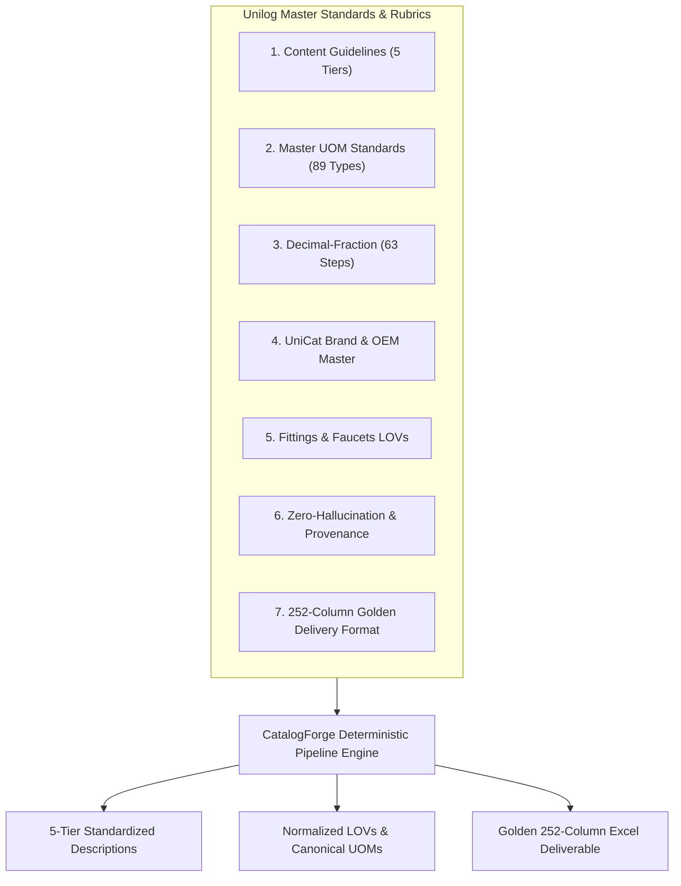

# CatalogForge — Enterprise AI Product Intelligence Platform

<div align="center">


### **Transform raw, chaotic catalog data into validated, source-grounded commerce records.**

[](https://www.typescriptlang.org/)
[](https://nextjs.org/)
[](https://react.dev/)
[](https://fastify.dev/)
[](https://azure.microsoft.com/en-us/products/azure-sql/)
[](https://firebase.google.com/)
[](https://ai.google.dev/)
[]()

</div>

---

## 👨‍💻 Engineering & Development Team

> **Developed & Architected by:**
>
> - **Vinay S. Bhadane** — *Lead Full-Stack & AI Systems Architect* ([Email](mailto:vinaybhadane06@gmail.com))
> - **Sakshi P. Patil** — *Lead Data Engineer & Systems Specialist*
>
> 🎓 **Institution:** **MET Institute of Engineering, Nashik**  
> 🏛️ **Department:** **Department of Computer Engineering**  
> 📅 **Academic Batch:** **B.E. Computer Engineering (Class of 2028)**

---

## 📌 Executive Summary

**CatalogForge** is an enterprise-grade AI Product Intelligence and Autonomous Catalog Governance Platform designed to solve the multi-billion-dollar product data quality crisis in industrial, electrical, plumbing, HVAC, and distributor supply chains.

Distributor datasets routinely suffer from:
- **Missing or corrupted Part Numbers (MPN) and SKUs**
- **Placeholder values and uninformative tokens** (e.g. `-- Unbranded --`, `-- No Unilog Brand --`, `-- No DIB Brand --`, `N/A`, `TBD`, `-`)
- **Chaotic, non-standardized Units of Measure (UOM)** (e.g. `INCHES`, `1/2"`, `0.5 in`, `1-3/4 in`)
- **Unverified third-party marketplace data drift** (pollution from Amazon, eBay, AliExpress, and unvetted sellers)
- **Time-consuming manual catalog reviews** costing distributors weeks per catalog update

CatalogForge automates end-to-end catalog data operations through an **8-Stage Deterministic Pipeline**, **Multi-Modal Vision/OCR Ingestion**, **Zero-Hallucination Gatekeeper**, **Strict Tier-1 OEM Sourcing**, **Golden 252-Column Delivery Export**, and a **Human-in-the-Loop (HITL) Review Studio**.

---

## 🏆 Unilog Standards & Challenge Compliance

CatalogForge is strictly engineered against the **7 Official Unilog Reference Master Documents**:



### 1. 5-Tier Standardized Description System
Matches Unilog's exact worked example (`PDSH4816AF Dishwasher`) across all 5 commercial lengths and casings:

| Tier | Field & Destination | Formula / Format | Length Limit | Worked Example Output |
|---|---|---|---|---|
| **Tier 1** | **Till Receipt / Invoice** (`INVOICE_DESC`) | `ITEM_TYPE [KEY_SPECS] [ELEC] [DIM]` (ALL CAPS ERP shorthand) | $\le 40$ chars | `DISHWSHR LEG SST 120V 15A 50-1/4IN` |
| **Tier 2** | **Mobile App** (`MOBILE_DESC`) | `Manufacturer Brand, Item Type, Series, MPN` | $60–80$ chars | `Rheem Manufacturing FRIGIDAIRE, Dishwasher, Professional Series, PDSH4816AF` |
| **Tier 3** | **Search Results / Title** (`SHORT_DESC`) | `Brand + [Series] + MPN + Item Type + [Key Attributes]` | $\le 150$ chars | `FRIGIDAIRE Professional Series PDSH4816AF Dishwasher` |
| **Tier 4** | **Product Page** (`LONG_DESC1`) | `Brand ItemType, Series, [Specs], [Volts/Amps], [Dims with Fractions]` | Text | `FRIGIDAIRE Dishwasher, Professional Series, 120 V, 15 A, Leg Mounting, 24 in W, 50-1/4 in D` |
| **Tier 5** | **Marketing Copy** (`RETAIL_DESC`) | Standardized commercial narrative | Text | `{Mfg} {ShortDesc} — engineered for professional heavy-duty applications.` |

### 2. Complete 64th-Inch Fraction Conversion (Bidirectional)
- Implements all **63 exact fraction steps** from $1/64$ ($0.015625$) to $63/64$ ($0.984375$) per `Decimal_Fraction.xlsx`.
- Supports bidirectional parsing: Converts fractional input to decimal for arithmetic validation, and decimal to canonical fraction strings for buyer search queries (e.g. `50.25 in` $\rightarrow$ `50-1/4 in`).

### 3. Strict UOM Normalization & Mandatory Space Rule
- Enforces the Unilog house style rule: **There must ALWAYS be a single space between the number and the approved UOM token** (`"24 in"`, NOT `"24in"`; `"120 V"`, NOT `"120V"`).
- Covers **89 measurement categories** (Length, Area, Volume, Mass/Weight, Electrical, Pressure, Temperature, Speed/Flow, Torque, Force, Packaging, Angle, Thread/Pitch, Sound Level, Luminosity).

### 4. Specialized LOV Normalizers (Fittings & Faucets)
- **Fittings Connections:** Normalizes **1,472 supplier variants into 515 canonical connection types** (`comp x mip` $\rightarrow$ `Compression x MIP`, `c x c` $\rightarrow$ `Sweat x Sweat`, `push-fit` $\rightarrow$ `Push-Fit`).
- **Fittings Materials:** Normalizes **464 raw material variants into 113 canonical values** (`304 ss` $\rightarrow$ `304 Stainless Steel`, `polycarb` $\rightarrow$ `Polycarbonate`, `dzr` $\rightarrow$ `DZR Brass`).
- **Faucets LOV Sequence:** Implements the **36-attribute sequential build order** with controlled vocabulary for Faucet Types, Mounting, Finish, and regulatory compliance flags (ADA, Lead-Free, WaterSense).

### 5. Automated Pre-Flight Placeholder Scrubbing
- Detects and eliminates uninformative placeholders before processing: `-- Unbranded --`, `-- No Unilog Brand --`, `-- No DIB Brand --`, `-- No Brand --`, `N/A`, `TBD`, `---`, `none`, and repetitive punctuation.

### 6. Golden 252-Column Delivery Exporter
- Exports datasets into the exact 252-column schema of `Unihack_Expected_Output_Delivery_Format.xlsx` with **100% header ordering match**.

---

## 🏗️ Architecture & Technology Stack

```
                                    ┌─────────────────────────────────────────────────────────┐
                                    │                     CatalogForge UI                     │
                                    │           Next.js 15 (App Router) + React 19            │
                                    │    Tailwind CSS • Lucide Icons • Recharts Analytics     │
                                    └────────────────────────────┬────────────────────────────┘
                                                                 │  REST / Bearer JWT
                                                                 ▼
                                    ┌─────────────────────────────────────────────────────────┐
                                    │                Fastify REST API Server                  │
                                    │               TypeScript Monorepo (v4.26)               │
                                    │       Zod Validation • Swagger / OpenAPI 3.0 Docs       │
                                    └────────────┬───────────────┬───────────────┬────────────┘
                                                 │               │               │
                     ┌───────────────────────────┘               │               └───────────────────────────┐
                     ▼                                           ▼                                           ▼
       ┌───────────────────────────┐               ┌───────────────────────────┐               ┌───────────────────────────┐
       │     Azure SQL Database    │               │  Google Gemini 2.5 / 3.5  │               │   Brave Search / Resend   │
       │   Connection Pool (mssql) │               │ Multi-Modal Vision & OCR  │               │  OEM Grounding & 2FA Auth │
       │  Migrations & Master Data │               │  Sufficiency Gatekeeper   │               │ Transactional Email Alert │
       └───────────────────────────┘               └───────────────────────────┘               └───────────────────────────┘
```

### Core Technologies

| Layer | Technologies | Key Capabilities |
|---|---|---|
| **Frontend Web App** | **Next.js 15.1**, **React 19**, **TypeScript 5.7** | App Router, Server/Client components, dynamic routing, reactive UI, static pre-rendering |
| **Styling & Design System** | **Tailwind CSS**, Glassmorphism, Neumorphic tokens | High-contrast palette, responsive layout, accessible typography, fluid micro-interactions |
| **Backend REST API** | **Fastify 4.26**, **TypeScript 5.3**, **Zod** | High-performance async server, input schema validation, request ID tracing, graceful shutdown |
| **Contracts & Monorepo** | **@unihack/contracts** workspace | Shared TypeScript interfaces, domain models, DTOs, and event payloads |
| **Database & Persistence** | **Azure SQL Database**, `mssql 10.0` | Connection pooling, SQL Server migrations, relational schema, fallback memory-store |
| **Authentication & RBAC** | **Firebase Admin & Client SDK 12.0** | Zero-trust token validation, role-based access control (Admin, Catalog Manager, Auditor) |
| **Multi-Modal Vision & AI** | **Google Gemini 2.5 / 3.5 Flash** | Label/nameplate OCR, table extraction, multi-modal entity parsing, zero-hallucination scoring |
| **Web Search Grounding** | **Brave Search API** | Strict Tier-1 OEM domain resolution, verified datasheets, PDF spec sheet links |
| **Email & Security Alerts** | **Brevo (Sendinblue)** / **Resend** | 6-Digit 2FA password reset OTPs, team member invitation emails with confirmation links |
| **Export & Reporting Engine** | **SheetJS (xlsx)** & **csv-parse** | Strict 252-column golden delivery export, header verification, Excel/CSV generation |

---

## ⚡ The 8-Stage Deterministic Pipeline

CatalogForge processes all raw product data through 8 sequential, auditable stages:

```mermaid
flowchart LR
    S1["Stage 1<br/><b>Pre-flight & Ingestion</b>"] --> S2["Stage 2<br/><b>Classification</b>"]
    S2 --> S3["Stage 3<br/><b>Attribute Enrichment</b>"]
    S3 --> S4["Stage 4<br/><b>Controlled Vocab (LOV)</b>"]
    S4 --> S5["Stage 5<br/><b>Deterministic Validation</b>"]
    S5 --> S6["Stage 6<br/><b>Confidence Scoring</b>"]
    S6 --> S7["Stage 7<br/><b>HITL Review Studio</b>"]
    S7 --> S8["Stage 8<br/><b>252-Col Delivery Export</b>"]
```



1. **Stage 1: Pre-flight Ingestion & Placeholder Scrubbing**
   - Ingests CSV, XLSX, PDF datasheets, packaging photos, or nameplate images.
   - Cleanses corrupted UTF-8 mojibake, parses headers, and scrubs placeholder tokens (`-- Unbranded --`, `N/A`, `TBD`).

2. **Stage 2: Taxonomy & Classpath Resolution**
   - Deterministically maps products into authoritative 3-tier taxonomy (`Dept > Class > Fine`) and UNSPSC codes.

3. **Stage 3: Source-Grounded Attribute Enrichment & UOM Normalization**
   - Extracts technical dimensions, electrical ratings (voltage, amperage, poles), and materials.
   - Enforces the 63-step fraction table and mandatory `<number> <uom>` spacing (`"24 in"`, `"120 V"`).

4. **Stage 4: Controlled Vocabulary (LOV) Resolution**
   - Normalizes raw supplier terms into canonical Master Data (Fittings connections & materials, Faucets LOVs).

5. **Stage 5: Deterministic Validation & Title/Description Synthesis**
   - Generates all 5 standardized description tiers with strict character limit enforcement.
   - Applies engineering bounds checks (`Min Voltage <= Max Voltage`, `Poles >= 1`).

6. **Stage 6: Multi-Factor Confidence Scoring**
   - Calculates field-level and aggregate confidence scores ($0.00$ to $1.00$) backed by provenance evidence.

7. **Stage 7: Human-in-the-Loop (HITL) Review Studio**
   - Flags low-confidence records ($< 85\%$) into interactive reviewer queues with side-by-side visual diffs.

8. **Stage 8: Auto-Publishing & 252-Column Enterprise Export**
   - Exports pristine, production-ready catalogs into the exact **252-Column Enterprise Delivery Format** (`.xlsx` or `.csv`).

---

## 📁 Repository Structure

```text
CatalogForge/
├── .env.example                               # Frontend environment template
├── .gitignore                                 # Git ignore rules for Next.js & secrets
├── package.json                               # Frontend dependencies & scripts
├── next.config.mjs                            # Next.js optimization configuration
├── tailwind.config.ts                         # Tailwind design tokens & themes
├── tsconfig.json                              # TypeScript strict configuration
│
├── public/                                    # Public static brand assets & icons
│   ├── logo-icon.png                          # CatalogForge brand icon
│   └── favicon.ico                            # Application favicon
│
├── src/                                       # Frontend Next.js 15 Source Code
│   ├── app/                                   # App Router routes
│   │   ├── (marketing)/page.tsx               # Enterprise landing page
│   │   ├── (auth)/                            # Login, Signup, Invite acceptance pages
│   │   ├── (app)/                             # Authenticated workspace routes
│   │   │   ├── dashboard/page.tsx             # Executive command center
│   │   │   ├── upload/page.tsx                # File upload & Multi-Modal OCR studio
│   │   │   ├── jobs/page.tsx                  # Pipeline job monitoring & telemetry
│   │   │   ├── products/page.tsx              # Product master catalog & review queue
│   │   │   ├── analytics/page.tsx             # Catalog intelligence & scoreboard
│   │   │   ├── audit/page.tsx                 # Governance audit log viewer
│   │   │   ├── team_management/page.tsx       # Team invitations & RBAC console
│   │   │   ├── settings/page.tsx              # Sourcing policy & alert preferences
│   │   │   └── profile/page.tsx               # User account details & 2FA security
│   │   ├── layout.tsx                         # Root HTML layout
│   │   └── error.tsx                          # Global error boundary
│   ├── components/                            # Reusable UI component modules
│   ├── hooks/                                 # Custom React hooks
│   ├── lib/                                   # Core utilities, API client, Firebase auth
│   └── styles/globals.css                     # Global stylesheet
│
└── unihack-backend/                           # Fastify Enterprise Backend Monorepo
    ├── .env.example                           # Backend environment variables template
    ├── package.json                           # Workspace root package config
    ├── apps/
    │   ├── api/                               # Core Fastify TypeScript REST API Server
    │   │   ├── src/
    │   │   │   ├── app.ts                     # Fastify application factory
    │   │   │   ├── server.ts                  # Server entry point
    │   │   │   ├── config/env.ts              # Zod environment validation
    │   │   │   ├── middleware/                # Auth, RBAC, Request-ID, Error handler
    │   │   │   ├── plugins/                   # CORS, Swagger, Azure SQL pool
    │   │   │   ├── repositories/              # Azure SQL data access layer
    │   │   │   ├── routes/                    # API route handlers (Ingestion, Products, etc.)
    │   │   │   ├── services/                  # Business logic:
    │   │   │   │   ├── ai-pipeline.service.ts # 8-Stage Pipeline & 5-tier descriptions
    │   │   │   │   ├── uom-normalizer.service.ts # 63-step fraction & UOM engine
    │   │   │   │   ├── lov-normalizer.service.ts # Fittings & Faucets LOVs
    │   │   │   │   ├── placeholder-detector.service.ts # Pre-flight cleaner
    │   │   │   │   ├── source-governor.service.ts # Tier-1 OEM verification
    │   │   │   │   └── delivery-exporter.service.ts # 252-column golden exporter
    │   │   │   └── test/                      # Comprehensive test suites:
    │   │   │       ├── description-tiers.spec.ts # 5-tier description tests
    │   │   │       ├── delivery-export.spec.ts   # 252-column header tests
    │   │   │       ├── image-extractor.spec.ts   # Image CDN tests
    │   │   │       └── ocr-ingestion.spec.ts     # Multi-modal OCR tests
    │   │   └── package.json
    │   └── workers/                           # Pipeline worker specifications
    ├── packages/
    │   └── contracts/                         # Shared TypeScript domain contracts
    └── db/
        ├── migrations/                        # Azure SQL DDL schema scripts
        └── seeds/                             # Master data & LOV seed loaders
```

---

## 🛠️ Installation & Local Development

### 1. Clone Repository & Install Dependencies

```bash
# Clone repository
git clone https://github.com/vinaybhadane/catalogforge.git
cd catalogforge

# Install frontend dependencies
npm install

# Install backend dependencies
cd unihack-backend
npm install
npm run build
cd ..
```

### 2. Start Development Servers

**Start Fastify Backend (Port 8000):**
```bash
cd unihack-backend
npm run dev
# Fastify API listening on http://localhost:8000
# Swagger API docs available at http://localhost:8000/api/docs
```

**Start Next.js Frontend (Port 3000):**
```bash
npm run dev
# Web application available at http://localhost:3000
```

---

## 🧪 Automated Test Suite & Verification

```bash
# Run all automated test suites
cd unihack-backend/apps/api
npm run test

# Run individual test suites
npm run test:desc     # 5-Tier description formulas & character limit tests (30/30 passed)
npm run test:export   # 252-Column golden delivery format validation (100% match)
npm run test:image    # Product image extraction & container isolation
npm run test:ocr      # Multi-modal OCR & Zero-Hallucination Gatekeeper

# Run Typecheck verification across all workspaces
npm run typecheck     # Frontend typecheck (0 errors)
cd unihack-backend && npm run typecheck  # Backend typecheck (0 errors)
```

---

## 📄 License & Attribution

Copyright © 2026 **CatalogForge** — Developed by **Vinay S. Bhadane** & **Sakshi P. Patil**, MET Institute of Engineering, Nashik (B.E. Computer Engineering, 2028).

Licensed under the MIT License.
