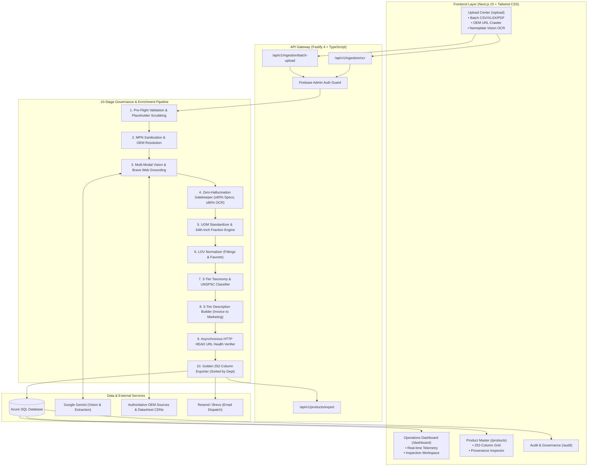

# CatalogForge

> **Autonomous AI Product Intelligence & Automated Catalog Governance Platform for Industrial Commerce**  
> Built for the **Unilog UniHack Hackathon**

[](https://www.catalogforge.tech)
[](https://nextjs.org/)
[](https://www.typescriptlang.org/)
[](https://fastify.dev/)
[](https://azure.microsoft.com/)
[](./LICENSE)

---

## 1. Problem Statement

Industrial distributors, wholesalers, and B2B marketplaces onboard millions of SKUs from hundreds of disparate suppliers. These raw supplier feeds are routinely plagued by:
- **Corrupted and incomplete identifiers:** Raw feeds mix distributor part numbers (`3MABR-7100075678`) with true OEM part numbers (`7100075678`) and list supplier names (`Jam Industrial Supply`) instead of true manufacturers (`3M`).
- **Pervasive placeholder pollution:** Essential fields are populated with uninformative tokens like `-- Unbranded --`, `-- No Unilog Brand --`, `N/A`, `TBD`, and `-`.
- **Chaotic units of measure & missing taxonomy:** Non-standard formatting (`1/2"`, `0.5 in`, `24in`) and blank classification fields (`Dept`, `Class`, `Fine`) break faceted catalog search.
- **Manual bottleneck & hallucination risk:** Catalog teams spend 20 to 45 minutes per SKU manually compiling datasheets, while generic LLMs hallucinate non-existent specifications and dead image links.

---

## 2. Our Solution

**CatalogForge** is an end-to-end, source-grounded product intelligence platform that automates industrial catalog onboarding. It ingests raw CSV/XLSX spreadsheets, manufacturer technical PDFs, physical product nameplate photos, and direct OEM URLs, executing a deterministic 10-stage governance pipeline to generate audit-ready, 252-column master catalog delivery records.

- **Production URL:** [https://www.catalogforge.tech](https://www.catalogforge.tech)  
- **Vercel Mirror:** [https://catalogforge-eosin.vercel.app](https://catalogforge-eosin.vercel.app)

---

## 3. Key Features

### A. Structured Data Generation
- **Raw-to-Structured Transformation:** Ingests sparse, dirty rows containing only an MPN and a fragmented description, producing structured electrical, mechanical, and dimensional attributes.
- **5-Tier Standardized Description Engine:** Generates commercial descriptions across 5 standardized tiers strictly aligned with Unilog catalog standards:
  - **Tier 1 — Till / Invoice (`INVOICE_DESC`):** Upper-case ERP abbreviation $\le 40$ characters (e.g., `DISHWSHR LEG SST 120V 15A 50-1/4IN`).
  - **Tier 2 — Mobile App (`MOBILE_DESC`):** Structured $50\text{--}80$ character hierarchy (`Manufacturer, Brand, Item Type, Series, MPN`).
  - **Tier 3 — Search Title (`SHORT_DESC`):** Clean buyer-facing title $\le 150$ characters (`Brand + Series + MPN + Item Type + Key Specs`).
  - **Tier 4 — Product Page (`LONG_DESC1`):** Complete comma-delimited specification narrative with normalized dimensions.
  - **Tier 5 — Marketing Copy (`RETAIL_DESC`):** Commercial narrative highlighting primary industrial applications.
- **Multi-Modal Vision & Nameplate OCR:** Direct ingestion of physical rating plates, packaging stickers, and motor label photos using multi-modal vision models.

### B. Accuracy & Consistency
- **UOM Normalizer & Mandatory Space Rule:** Governs 89 measurement categories (Length, Voltage, Current, Pressure, Torque, Sound, Temperature). Strictly enforces the Unilog single-space standard (`"24 in"`, never `"24in"`; `"120 V"`, never `"120V"`).
- **64th-Inch Bidirectional Fraction Engine:** Implements all 63 decimal-to-fraction steps (from $1/64 = 0.015625$ to $63/64 = 0.984375$), converting dimensions into canonical buyer-facing fraction strings (e.g., `50.25 in` $\rightarrow$ `50-1/4 in`).
- **Controlled Vocabulary (LOV) Normalization:** Standardizes 1,472 raw plumbing/fitting connection variants into 515 canonical forms (e.g., `comp x mip` $\rightarrow$ `Compression x MIP`, `c x c` $\rightarrow$ `Sweat x Sweat`), and 464 material variants into 113 standard terms (`304 ss` $\rightarrow$ `304 Stainless Steel`).
- **Pre-Flight Placeholder Scrubber:** Automatically scrubs uninformative vendor tokens (`-- Unbranded --`, `-- No DIB Brand --`, `TBD`, `N/A`) before enrichment begins.

### C. AI Validation & Enrichment
- **Strict Zero-Hallucination Policy:** Technical specifications require $\ge 60\%$ confidence directly grounded in authoritative OEM data. If a field cannot be grounded, it is left strictly blank (`blank_zero_hallucination`) rather than guessed.
- **Multi-Modal Sufficiency Gatekeeper:** Label OCR extraction enforces an automated $\ge 80\%$ sufficiency gatekeeper. If core identifiers cannot be identified with $\ge 80\%$ confidence, extraction is safely aborted (`ABORTED_INSUFFICIENT_DATA`) to prevent corrupted records.
- **Authoritative OEM Sourcing & Blacklist Enforcement:** Prioritizes Tier-1 manufacturer domains. Explicitly blacklists 33+ consumer marketplaces (Amazon, eBay, Walmart, AliExpress, etc.) to prevent consumer marketplace data drift.
- **Automated Head-Check URL Health Verifier:** Executes asynchronous HTTP `HEAD` checks against all candidate product images, spec sheets, and warranty PDFs. Non-200 responses, redirects to homepages, and timeouts are automatically discarded.
- **3-Tier Taxonomy Engine:** Deduces retail hierarchy (**Dept**, **Class**, **Fine**) and standard UNSPSC classification codes (e.g., `appliances > large appliances > dishwasher`, UNSPSC `40151500`).

### D. Scalable Catalog Engine
- **Golden 252-Column Delivery Exporter:** Generates delivery deliverables matching 100% of the 252 ordered headers defined in `Unihack_Expected_Output_Delivery_Format.xlsx`, with output rows automatically sorted alphabetically by Department (`Dept`).
- **Batch Processing & Session Restoration:** Handles batch file uploads (CSV, XLSX, PDF) with pre-flight scans, background pipeline processing, and session recovery via unique `batchId` keys.
- **Instant Export & Automated Dispatch:** Provides single-click XLSX/CSV schema export, shareable dataset URLs, and automated email delivery of generated deliverables.

---

## 4. Explainability & Provenance

Every data point generated by CatalogForge is fully inspectable:
1. **Confidence Scoring:** Each attribute displays an explicit confidence score ($0.00\text{--}1.00$) calculated across extraction density and validation rules.
2. **Source Grounding URLs:** Every extracted specification and asset links directly to the source evidence URL (OEM product page, technical datasheet PDF, or CDN asset).
3. **Audit Trails:** The Governance Audit Log tracks the exact action, timestamp, user context, and pipeline stage for every catalog mutation.
4. **Human-in-the-Loop (HITL) Queue:** Items with confidence scores $< 85\%$ are flagged in a dedicated Pending Review workspace, allowing catalog managers to approve or amend values before publication.

---

## 5. System Architecture


```mermaid
flowchart TD
    subgraph ClientLayer["Frontend Layer (Next.js 15 + Tailwind CSS)"]
        UI_Upload["Upload Center (/upload)<br/>• Batch CSV/XLSX/PDF<br/>• OEM URL Crawler<br/>• Nameplate Vision OCR"]
        UI_Dashboard["Operations Dashboard (/dashboard)<br/>• Real-time Telemetry<br/>• Inspection Workspace"]
        UI_Products["Product Master (/products)<br/>• 252-Column Grid<br/>• Provenance Inspector"]
        UI_Audit["Audit & Governance (/audit)"]
    end

    subgraph ApiLayer["API Gateway (Fastify 4 + TypeScript)"]
        API_Auth["Firebase Admin Auth Guard"]
        API_Upload["/api/v1/ingestion/batch-upload"]
        API_Ocr["/api/v1/ingestion/ocr"]
        API_Export["/api/v1/products/export"]
    end

    subgraph Pipeline["10-Stage Governance & Enrichment Pipeline"]
        S1["1. Pre-Flight Validation & Placeholder Scrubbing"]
        S2["2. MPN Sanitization & OEM Resolution"]
        S3["3. Multi-Modal Vision & Brave Web Grounding"]
        S4["4. Zero-Hallucination Gatekeeper (≥60% Specs, ≥80% OCR)"]
        S5["5. UOM Standardizer & 64th-Inch Fraction Engine"]
        S6["6. LOV Normalizer (Fittings & Faucets)"]
        S7["7. 3-Tier Taxonomy & UNSPSC Classifier"]
        S8["8. 5-Tier Description Builder (Invoice to Marketing)"]
        S9["9. Asynchronous HTTP HEAD URL Health Verifier"]
        S10["10. Golden 252-Column Exporter (Sorted by Dept)"]
    end

    subgraph StorageLayer["Data & External Services"]
        DB_SQL[(Azure SQL Database)]
        AI_Gemini["Google Gemini (Vision & Extraction)"]
        EXT_Web["Authoritative OEM Sources & Datasheet CDNs"]
        NOTIF["Resend / Brevo (Email Dispatch)"]
    end

    UI_Upload --> API_Upload
    UI_Upload --> API_Ocr
    API_Upload --> API_Auth
    API_Ocr --> API_Auth

    API_Auth --> S1
    S1 --> S2 --> S3
    S3 <--> AI_Gemini
    S3 <--> EXT_Web
    S3 --> S4 --> S5 --> S6 --> S7 --> S8 --> S9 --> S10

    S10 --> API_Export
    S10 --> DB_SQL
    S10 --> NOTIF
    DB_SQL --> UI_Dashboard
    DB_SQL --> UI_Products
    DB_SQL --> UI_Audit
```

---

## 6. Technology Stack

| Layer | Technologies | Purpose |
|---|---|---|
| **Frontend Framework** | Next.js 15 (App Router), React 19, TypeScript 5.7 | High-performance enterprise dashboard & catalog studio |
| **Styling & Icons** | Tailwind CSS 3.4, Lucide React | B2B industrial design system, responsive UI |
| **Backend Runtime** | Fastify 4.26, Node.js 20+, TypeScript 5.3 | High-throughput, low-overhead REST API server |
| **Database** | Azure SQL (MSSQL), `mssql` client | Relational catalog storage, jobs, audit logs, attributes |
| **Authentication** | Firebase Authentication & Firebase Admin SDK | Zero-trust token authentication, role-based access control |
| **AI / Multi-Modal Vision** | Google Gemini (`gemini-2.5-flash`, `gemini-3.5-flash-lite`) | Label OCR, technical attribute extraction, reasoning |
| **Web Sourcing** | Brave Search API, Schema.org JSON-LD Parsers | Authoritative OEM discovery, datasheet acquisition |
| **Spreadsheet Engine** | SheetJS (`xlsx`), `csv-parse` | Ingestion & generation of 252-column Excel/CSV files |
| **Document Parsing** | `pdf-parse` | Multi-page OEM technical datasheet & specification parsing |
| **Email & Alerts** | Resend API, Brevo SMTP | Batch completion alerts, deliverable dispatch, team invites |

---

## 7. Sample Input $\rightarrow$ Enriched Output

The table below demonstrates real rows from `Unihack_ Sample Dataset - Input (1).csv` processed through the CatalogForge pipeline:

### Row 1: Freud / Diablo Sanding Belt
| Field | Raw Supplier Input | CatalogForge Enriched Output |
|---|---|---|
| `Mfg_Part_Num` | `DCB518ASTS06G` | `DCB518ASTS06G` |
| `Part_Desc` | `DCB518ASTS06G Diablo 1/2"x18" - Sanding Belt 6pc` | `Diablo DCB518ASTS06G 1/2 in. x 18 in. Sanding Belt (6-Pack)` |
| `Part_Manuf` | `Freud Inc (2435)` *(contains internal code)* | `Freud Inc` *(sanitized OEM)* |
| `BRAND_NAME` | `-- Unbranded --` *(placeholder)* | `Diablo` *(resolved)* |
| `Dept` / `Class` / `Fine` | *(empty)* | `abrasives` / `sanding belts & discs` / `sanding belts` |
| `UNSPSC` | *(empty)* | `31191500` |
| `INVOICE_DESC` | *(empty)* | `SNDG BELT 1/2IN` *(≤40 chars)* |
| `MOBILE_DESC` | *(empty)* | `Freud Inc Diablo, Sanding Belt, DCB518ASTS06G` |
| `Key Attributes` | *(unstructured text)* | **Width:** `1/2 in` (0.5 in) • **Length:** `18 in` • **Pack Qty:** `6` • **Abrasive:** `Aluminum Oxide` |
| `Product Image` | *(empty)* | Verified OEM primary image URL (valid HTTP 200) |

### Row 2: 3M Cubitron II Sanding Disc
| Field | Raw Supplier Input | CatalogForge Enriched Output |
|---|---|---|
| `Mfg_Part_Num` | `3MABR-7100075678` *(prefixed distributor SKU)* | `7100075678` *(canonical OEM MPN)* |
| `Part_Desc` | `3M 775L Stikit Film P150 - Cubitron II 50 Disc/Box` | `3M Cubitron II 775L Stikit Film Disc P150 (50/Box)` |
| `Part_Manuf` | `Jam Industrial Supply LLC (JAMIN)` *(distributor)* | `3M` *(true OEM resolved, distributor suppressed)* |
| `BRAND_NAME` | `-- No Unilog Brand --` *(placeholder)* | `Cubitron II` *(resolved)* |
| `Dept` / `Class` / `Fine` | *(empty)* | `abrasives` / `sanding discs` / `film discs` |
| `INVOICE_DESC` | *(empty)* | `DISC 775L STIKIT P150 50PK` *(≤40 chars)* |
| `Key Attributes` | *(unstructured text)* | **Grit:** `P150` • **Attachment:** `Stikit` • **Series:** `775L` • **Backing:** `Film` |

### Row 3: Square D Homeline Circuit Breaker
| Field | Raw Supplier Input | CatalogForge Enriched Output |
|---|---|---|
| `Mfg_Part_Num` | `HOM120` | `HOM120` |
| `MANUFACTURER_NAME` | *(empty)* | `Schneider Electric` |
| `BRAND_NAME` | *(empty)* | `Square D` |
| `Dept` / `Class` / `Fine` | *(empty)* | `electrical` / `distribution equipment` / `circuit breakers` |
| `UNSPSC` | *(empty)* | `39121601` |
| `INVOICE_DESC` | *(empty)* | `CKT BKR 120V 20A` *(≤40 chars)* |
| `Key Attributes` | *(empty)* | **Voltage:** `120 V` • **Current:** `20 A` • **Poles:** `1` • **Mounting:** `Plug-in` |

---

## 8. Quickstart Guide

### Prerequisites
- **Node.js:** `v20.x` or higher
- **npm:** `v10.x` or higher
- **Git**

### 1. Clone the Repository
```bash
git clone https://github.com/vinaybhadane/catalogforge.git
cd catalogforge
```

### 2. Frontend Setup
```bash
# Install frontend dependencies
npm install

# Configure environment variables
cp .env.example .env.local

# Run Next.js development server
npm run dev
```
The frontend is accessible at `http://localhost:3000`.

### 3. Backend Setup
```bash
# Navigate to backend workspace
cd unihack-backend

# Install backend dependencies
npm install

# Configure backend environment variables
cp .env.example .env

# Run Fastify development server
npm run dev
```
The backend API is accessible at `http://localhost:8000`. Swagger documentation is available at `http://localhost:8000/documentation`.

### 4. Running Verification & Tests
```bash
# Run frontend TypeScript type checking
npm run typecheck

# Run frontend production build
npm run build

# Run backend unit & integration test suites
cd unihack-backend
npm run test
```

---

## 9. Environment Variables Reference

### Frontend (`.env.local`)
| Variable | Required | Description |
|---|---|---|
| `NEXT_PUBLIC_API_URL` | Yes | Backend REST API Base URL (e.g., `http://localhost:8000/api/v1`) |
| `NEXT_PUBLIC_FIREBASE_API_KEY` | Yes | Firebase Client API key |
| `NEXT_PUBLIC_FIREBASE_AUTH_DOMAIN` | Yes | Firebase authentication domain |
| `NEXT_PUBLIC_FIREBASE_PROJECT_ID` | Yes | Firebase Project ID |
| `NEXT_PUBLIC_FIREBASE_STORAGE_BUCKET` | Optional | Firebase Storage bucket |
| `NEXT_PUBLIC_FIREBASE_MESSAGING_SENDER_ID` | Optional | Firebase sender ID |
| `NEXT_PUBLIC_FIREBASE_APP_ID` | Yes | Firebase Application ID |
| `NEXT_PUBLIC_BREVO_SENDER_EMAIL` | Optional | Transactional sender address |

### Backend (`unihack-backend/.env`)
| Variable | Required | Description |
|---|---|---|
| `PORT` | Yes | HTTP port for Fastify server (default: `8000`) |
| `HOST` | Yes | Network host (default: `0.0.0.0`) |
| `AZURE_SQL_CONNECTION_STRING` | Optional | Azure SQL connection string (falls back to in-memory store if unset) |
| `FIREBASE_PROJECT_ID` | Yes | Firebase project identifier for token verification |
| `FIREBASE_CLIENT_EMAIL` | Optional | Firebase service account email |
| `FIREBASE_PRIVATE_KEY` | Optional | Firebase service account private key |
| `GEMINI_API_KEY` | Yes | Google Gemini API key for vision OCR and extraction |
| `GEMINI_MODEL` | Optional | Model identifier (default: `gemini-2.5-flash`) |
| `BRAVE_SEARCH_API_KEY` | Optional | Brave Search API key for live web OEM sourcing |
| `RESEND_API_KEY` | Optional | Resend API key for automated deliverable emails |

---

## 10. Project Structure

```text
CatalogForge/
├── src/                                  # Next.js 15 Frontend
│   ├── app/                              # App Router Pages
│   │   ├── (app)/                        # Authenticated Workspace Shell
│   │   │   ├── dashboard/page.tsx        # Telemetry, Metrics & Inspection
│   │   │   ├── upload/page.tsx           # Multi-Modal Upload (File, URL, OCR)
│   │   │   ├── products/page.tsx         # 252-Column Master Catalog
│   │   │   ├── jobs/page.tsx             # Pipeline Jobs & Execution State
│   │   │   ├── analytics/page.tsx        # Catalog Intelligence & Charts
│   │   │   ├── audit/page.tsx            # Governance Audit Logs
│   │   │   └── settings/page.tsx         # System Configuration & Roles
│   │   ├── login/page.tsx                # Authentication Portal
│   │   └── layout.tsx                    # Root Layout & B2B Header/Sidebar
│   ├── components/                       # Reusable UI Components
│   ├── hooks/                            # Custom React Hooks
│   └── lib/                              # API Client, Auth & Sanitizers
├── unihack-backend/                      # Enterprise Fastify Backend
│   ├── apps/
│   │   └── api/src/
│   │       ├── routes/                   # REST Routes (Ingestion, Products, Jobs)
│   │       ├── services/                 # Core Pipeline Services
│   │       │   ├── batch-file-enricher.service.ts # File Ingestion & AI Enrichment
│   │       │   ├── delivery-exporter.service.ts   # 252-Column Golden Exporter
│   │       │   ├── ocr-ingestion.service.ts       # Vision & Gatekeeper Engine
│   │       │   ├── uom-normalizer.service.ts      # UOM & 64th Fraction Rules
│   │       │   ├── taxonomy-classifier.service.ts # 3-Tier Hierarchy Resolver
│   │       │   └── gemini-search.service.ts       # Grounded Web Sourcing
│   │       ├── repositories/             # Database Repositories
│   │       └── test/                     # Spec & Verification Test Suites
│   ├── db/                               # Database Schemas & Migrations
│   └── packages/contracts/               # Shared TypeScript Type Contracts
├── Unihack_ Sample Dataset - Input (1).csv # Official Hackathon Sample Input
├── Unihack_Expected_Output_Delivery_Format.xlsx # 252-Column Golden Output Schema
├── LICENSE                               # MIT License
└── package.json                          # Root Dependencies & Build Scripts
```

---

## 11. Limitations & Known Issues

1. **Third-Party AI Rate Limits:** Heavy multi-modal vision or live web extraction workloads rely on external API quotas (Gemini / Brave Search). During high concurrency, batch processing is rate-limited to prevent throttling.
2. **Interactive Demo Batch Limit:** To deliver sub-30-second responses during live hackathon judging evaluations, browser file uploads are capped to the first 7 rows by default. Complete un-capped runs can be executed via background batch workers.
3. **OEM Cloudflare & Bot Challenges:** Certain manufacturer websites employ aggressive bot detection that blocks direct HTTP crawling. In these scenarios, the pipeline falls back to secondary authoritative datasheet repositories or retains previous verified fields.

---

## 12. Roadmap

- [ ] **Distributed Task Queue:** Migrate batch processing to Redis-backed BullMQ workers for enterprise multi-thousand-SKU parallel pipelines.
- [ ] **Direct GS1 / GDSN Network Integration:** Native connector for synchronizing enriched catalog records directly with GDSN data pools.
- [ ] **On-Premises Air-Gapped OCR:** Containerized inference using quantized open-weight vision models (e.g., Llama-3.2-Vision) for high-security defense and industrial manufacturing networks.
- [ ] **Automated CAD / 3D Asset Binding:** Automatic extraction and association of STEP/DWG CAD models from OEM download portals.

---

## 13. Team & Acknowledgements

### Engineering Team
- **Vinay S. Bhadane** — Lead Full-Stack & AI Systems Architect  
  *Email:* [vinaybhadane06@gmail.com](mailto:vinaybhadane06@gmail.com)
- **Sakshi P. Patil** — Lead Data Engineer & Systems Specialist  
  *Email:* [patilsakshi18027@gmail.com](mailto:patilsakshi18027@gmail.com)

**Institution:** MET Institute of Engineering, Nashik — Department of Computer Engineering (B.E. Computer Engineering, Class of 2028)

### Acknowledgements
Built for **Unilog's UniHack Hackathon 2026**. Special thanks to the Unilog technical committee for providing the master rubrics, 252-column delivery schemas, UOM dictionaries, and evaluation datasets.

---

## 14. License

This project is licensed under the **MIT License** — see the [LICENSE](./LICENSE) file for details.
